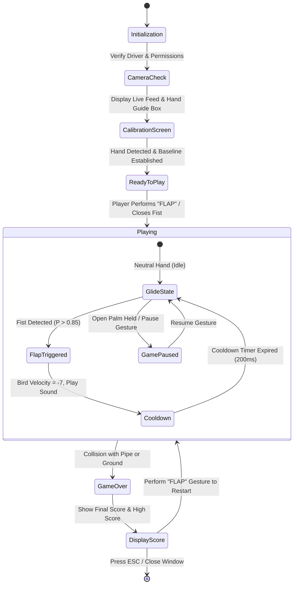
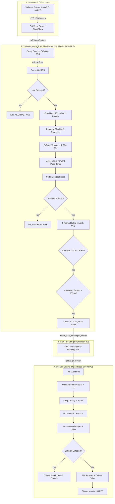

# Product Requirements Document (PRD)

## Project: VisionFly — Real-Time Hand Gesture Controlled Flappy Bird
**Document Version**: 1.0.0  
**Status**: Approved for Architectural Planning  
**Target Release**: Academic Prototype / Interactive Showcase  
**Lead Developers**: Abhishek Dutta & Samhita Mondal  
**Engineering Mentorship**: Computer Vision, Machine Learning & Systems Architecture  

---

## 1. PRODUCT NAME & METADATA

* **Official Product Name**: **VisionFly**
* **Subtitle**: *Real-Time Hand Gesture Controlled Flappy Bird*
* **Repository**: `Flappy-Bird-Hand-Guestures`
* **Target Runtime**: Local Desktop (Windows 10/11, macOS, Linux) with standard USB/integrated RGB webcam
* **Primary Tech Stack**: Python 3.10+, OpenCV, PyTorch / Torchvision, MediaPipe, Pygame, NumPy

---

## 2. PRODUCT VISION

VisionFly transforms the classic keyboard-based arcade game *Flappy Bird* into an immersive, touchless, vision-driven interactive experience. By fusing modern computer vision (real-time hand localization) and deep learning (convolutional neural network gesture classification) with high-performance concurrent game physics, VisionFly enables players to navigate the bird through obstacles using natural, intuitive hand gestures captured by an everyday webcam.

The product serves a dual purpose:
1. **End-User Value**: Delivers a responsive, fun, low-latency, and zero-peripheral arcade experience.
2. **Pedagogical & Engineering Value**: Serves as a transparent, first-principles demonstration of real-time computer vision, deep transfer learning, temporal signal filtering, and multithreaded game-engine concurrency.

---

## 3. PROBLEM STATEMENT

Standard interactive computer games rely on tactile, mechanical peripherals (keyboards, mice, gamepads). While reliable, these devices offer limited immersion and are inaccessible to users who cannot operate physical switches.

Conversely, existing educational hand-gesture recognition projects suffer from three widespread engineering flaws:
1. **Severe Latency ($>150\text{ ms}$)**: Processing frames synchronously inside the game loop causes drastic frame-rate drops (chugging at 15–20 FPS), making fast reaction games like Flappy Bird impossible to play.
2. **Prediction Jitter & Accidental Triggers**: Raw, frame-by-frame deep learning predictions are noisy. Without temporal smoothing and state debouncing, random camera noise triggers false flaps, frustrating the player.
3. **Fragility to Real-World Conditions**: Many models are trained on simplistic, clean datasets and instantly fail when exposed to real-world webcam video containing varying skin tones, cluttered room backgrounds, and poor lighting.

VisionFly directly solves these problems through an asynchronous multithreaded architecture, a two-stage localization-classification pipeline, robust transfer learning, and temporal state-machine debouncing.

---

## 4. PRODUCT GOALS

* **G-1 (Real-Time Ingestion)**: Ingest live 30 FPS RGB video streams from any standard 720p or 1080p webcam with negligible frame-drop.
* **G-2 (Accurate Hand Localization)**: Automatically detect hand presence and isolate the hand region of interest (ROI) across varied lighting conditions and complex backgrounds.
* **G-3 (High-Confidence Gesture Classification)**: Classify user hand gestures into discrete game commands (Neutral/Idle, Flap, Pause) with $>95\%$ validation accuracy.
* **G-4 (Sub-60ms End-to-End Latency)**: Ensure the total elapsed time between physical hand gesture initiation and the bird's vertical impulse in Pygame remains strictly under **60 milliseconds**.
* **G-5 (Fluid 60 FPS Game Rendering)**: Maintain an uncompromised, rock-solid 60 FPS rendering rate in the Pygame game engine by running vision inference asynchronously on a dedicated worker thread.
* **G-6 (Zero-Jitter Control)**: Eliminate single-frame glitches and false triggers using temporal rolling-window voting and physical state debouncing.
* **G-7 (Transparent Visual HUD)**: Provide an unobtrusive Picture-in-Picture (PiP) camera overlay showing real-time hand tracking status, classification label, confidence score, and FPS.

---

## 5. NON-GOALS (OUT OF SCOPE FOR MVP)

To ensure high execution quality, the initial release (v1.0) explicitly excludes:
* **NG-1 (No Massive Gesture Vocabulary)**: We will *not* support American Sign Language (ASL) or large 20+ gesture alphabets. The game strictly requires a focused 3-class vocabulary (`Neutral`, `Flap`, `Pause`).
* **NG-2 (No Custom Foundation Models or Transformers)**: We will *not* train an unneeded Vision Transformer (ViT) or large foundation model from scratch. We leverage lightweight, battle-tested architectures (MobileNetV2 / MediaPipe).
* **NG-3 (No Dynamic Trajectory Gestures in MVP)**: We will *not* implement complex recurrent LSTM/GRU swipe gestures for the core flap mechanic, as temporal sequence buffering adds latency that undermines reaction-time gameplay.
* **NG-4 (No Mobile / Embedded Port)**: The MVP will not be compiled for Android, iOS, or Raspberry Pi. It targets standard desktop platforms.
* **NG-5 (No Cloud Processing / Remote Inference)**: All video frames and neural network inferences will run 100% locally on the user's CPU/GPU. No remote API calls will be made.

---

## 6. TARGET USERS & PERSONAS

### Persona A: The Casual Player ("Sam")
* **Profile**: Wants a novel, fun, touchless gaming experience.
* **Expectations**: The game should launch seamlessly, calibrate their hand in 5 seconds, and respond instantly to their gestures without requiring an expensive gaming GPU or complex configuration.

### Persona B: The Academic Evaluator / Computer Science Student ("Alex")
* **Profile**: Evaluates the technical rigor, software design, and machine learning architecture of the project.
* **Expectations**: Clean code organization, clear separation of concerns, reproducible training pipelines, comprehensive confusion matrices, and clear explanations of why specific trade-offs were chosen.

---

## 7. USER EXPERIENCE & WORKFLOW



### Detailed Step-by-Step User Flow:
1. **Launch**: User runs `python main.py`. Pygame window initializes, and the background vision worker initializes the webcam.
2. **Camera Check & Permission**: If camera access fails, an informative diagnostic screen guides the user to check device permissions or close competing apps.
3. **Calibration / Start Screen**: The screen displays the classic Flappy Bird title alongside a live PiP webcam preview. An on-screen bounding guide prompts: *"Place your hand in front of the camera. Close your fist to start!"*
4. **Gameplay**:
   * Holding hand open (Neutral): Bird falls under gravity ($+0.4\text{ px/frame}^2$).
   * Clenching fist (Flap): Vision model detects gesture within 25 ms, dispatches event, bird immediately leaps upward ($v = -7.0\text{ px/frame}$), and `flap.wav` plays.
   * Player navigates through pipes and collects bonus coins.
5. **Game Over & Restart**: Upon collision, `hit.wav` and `die.wav` trigger. Game Over screen displays the final score and top high-score retrieved from the database. A countdown or quick fist clench restarts the game instantly without touching the keyboard.

---

## 8. FUNCTIONAL REQUIREMENTS (FR)

### Category 1: Camera & Ingestion Pipeline
* **FR-001**: System MUST connect to the primary system webcam using OpenCV VideoCapture backend (DirectShow on Windows, V4L2 on Linux, AVFoundation on macOS).
* **FR-002**: System MUST capture frames at a resolution of at least $640 \times 480$ at a minimum stable capture rate of 30 FPS.
* **FR-003**: System MUST automatically convert raw BGR frames into standard RGB format prior to passing frames to downstream computer vision and deep learning modules.
* **FR-004**: System MUST gracefully release camera hardware handles (`cap.release()`) upon game exit or unhandled exception.

### Category 2: Hand Detection & ROI Extraction
* **FR-005**: System MUST determine whether at least one human hand is present in the video frame with a detection confidence threshold $\ge 0.70$.
* **FR-006**: When a hand is detected, the system MUST extract a square Region of Interest (ROI) bounding box enclosing the hand with a minimum $15\%$ padding margin.
* **FR-007**: System MUST clamp bounding box coordinates strictly to frame boundaries ($0 \le x_1 < x_2 \le W$, $0 \le y_1 < y_2 \le H$) to prevent out-of-bounds slicing exceptions.
* **FR-008**: System MUST resize the cropped hand ROI to a standardized input dimension ($224 \times 224$ pixels) using bilinear interpolation.

### Category 3: Machine Learning & Gesture Classification
* **FR-009**: System MUST classify the standardized hand ROI into one of three primary classes:
  * `Class 0`: **Neutral / Idle** (Open hand or resting position)
  * `Class 1`: **Flap** (Closed fist or crisp snap gesture)
  * `Class 2`: **Pause / Special** (Optional pause trigger)
* **FR-010**: The classification model MUST compute a normalized probability distribution using the Softmax function over the class logits.
* **FR-011**: System MUST enforce a minimum confidence threshold ($P_{\text{class}} \ge 0.85$). Predictions with confidence $< 0.85$ MUST be designated as `UNCERTAIN` and discarded.

### Category 4: Temporal Stabilization & Event Filtering
* **FR-012**: System MUST maintain a rolling FIFO buffer of the last $N = 5$ consecutive valid frame predictions.
* **FR-013**: System MUST apply statistical majority voting (mode) across the rolling buffer to suppress single-frame transient classification glitches.
* **FR-014**: System MUST implement a **State-Transition Trigger**: a game action MUST only be dispatched when the stabilized state changes from `NEUTRAL` $\to$ `FLAP`.
* **FR-015**: System MUST enforce an algorithmic **cooldown window** (debounce duration of $200\text{ ms}$) following a registered flap event to prevent unwanted double-jumping.

### Category 5: Game Concurrency & Control
* **FR-016**: The Computer Vision pipeline and the Pygame Game Engine MUST execute on separate, concurrent execution threads.
* **FR-017**: Communication between the vision worker thread and the game thread MUST occur via a thread-safe, non-blocking queue (`queue.Queue`).
* **FR-018**: When a `FLAP` event is retrieved from the queue, the game engine MUST immediately set `bird_velocity = -7.0` and trigger the wing flap audio effect.
* **FR-019**: Physical keyboard controls (`SPACE` to flap, `ESC` to quit) MUST remain fully operational simultaneously as a fallback and debugging control mechanism.

### Category 6: HUD & Visual Diagnostics
* **FR-020**: System MUST render an optional debug overlay displaying:
  * Live camera PiP thumbnail in corner of screen.
  * Detected hand bounding box and landmark joints.
  * Real-time gesture prediction text and confidence percentage.
  * Current vision worker FPS and game render FPS.
* **FR-021**: User MUST be able to toggle the debug HUD visibility on/off by pressing the `H` key.

### Category 7: Game Scoring, Persistence & State Management
* **FR-022**: System MUST increment score by $+1$ for every pipe successfully cleared.
* **FR-023**: System MUST increment score by $+5$ when collecting a bonus coin.
* **FR-024**: System MUST persist high scores to a local SQLite database (or optional MySQL instance) and display the highest recorded score on the game over screen.

---

## 9. NON-FUNCTIONAL REQUIREMENTS (NFR)

### Performance & Latency
* **NFR-001 (Game Frame Rate)**: Pygame rendering loop MUST maintain a steady **$60 \pm 2\text{ FPS}$** on a standard quad-core Intel Core i5 / AMD Ryzen 5 laptop without a dedicated GPU.
* **NFR-002 (Vision Frame Rate)**: Vision processing thread MUST maintain an inference throughput of **$\ge 25\text{ FPS}$** (frame interval $\le 40\text{ ms}$).
* **NFR-003 (Motion-to-Action Latency)**: Total time from physical hand motion to game physics update MUST NOT exceed **$60\text{ milliseconds}$**.
* **NFR-004 (Memory Footprint)**: Total resident memory consumption (RAM) of the running application MUST NOT exceed **$500\text{ MB}$**.

### Reliability & Fault Tolerance
* **NFR-005 (Camera Disconnection Handling)**: If the webcam is physically unplugged or stream drops, the game MUST pause immediately, display an on-screen alert, and allow keyboard fallback without crashing.
* **NFR-006 (Thread Health Monitoring)**: Vision worker thread MUST catch internal runtime exceptions and log diagnostics without terminating the main game process.

### Usability & Accessibility
* **NFR-007 (Lighting Adaptability)**: The vision pipeline MUST maintain reliable hand tracking across an ambient lighting range of 150 lux (dim indoor lighting) to 1,000 lux (bright daylight).
* **NFR-008 (Zero External Hardware)**: System MUST require no specialized sensory peripherals (no Leap Motion, no depth sensors, no wearable data gloves).

### Privacy & Data Protection
* **NFR-009 (Zero Video Persistence)**: System MUST NOT write raw camera video or audio recordings to disk during standard gameplay. Frames MUST reside exclusively in volatile memory and be overwritten immediately.
* **NFR-010 (Local Air-Gapped Operation)**: System MUST run completely offline without requiring an active internet connection.

---

## 10. MACHINE LEARNING REQUIREMENTS

### Dataset Specifications
* **Dataset Size**: Minimum 1,500 total labeled images (500 samples per class: `Neutral`, `Flap`, `Pause/Background`).
* **Source**: Curated subset of HaGRID (Apache 2.0 open-source dataset) supplemented by 300 custom webcam calibration frames.
* **Demographic Diversity**: Data MUST contain diverse skin tones (Fitzpatrick scale Types I–VI) and equal proportions of left and right hands.
* **Dataset Partitioning**: Strict Subject-Wise / Session-Wise split:
  * **Training Set**: $70\%$ ($\approx 1,050$ images)
  * **Validation Set**: $15\%$ ($\approx 225$ images)
  * **Test Set**: $15\%$ ($\approx 225$ images)
  * *Constraint*: Zero frame-burst leakage between splits.

### Training & Architecture Specifications
* **Base Backbone**: `MobileNetV2` pretrained on ImageNet-1K.
* **Input Tensor Shape**: $(B, 3, 224, 224)$ normalized with ImageNet mean $[0.485, 0.456, 0.406]$ and std $[0.229, 0.224, 0.225]$.
* **Classification Head**: `nn.Sequential(nn.Dropout(p=0.2), nn.Linear(1280, 3))`.
* **Loss Function**: Categorical Cross-Entropy Loss (`torch.nn.CrossEntropyLoss`).
* **Optimizer**: Adam ($\beta_1 = 0.9, \beta_2 = 0.999$, $\alpha = 1 \times 10^{-3}$, weight decay $= 1 \times 10^{-4}$).
* **Regularization**: Data augmentations (Rotation $\pm 15^\circ$, Color Jitter $\pm 0.2$, Scaling $\pm 10\%$, Gaussian Blur) and Early Stopping (patience $= 5$ epochs).

### Model Evaluation Targets
* **Test Accuracy**: $\ge 95.0\%$ across the held-out test split.
* **Class 1 (Flap) Precision**: $\ge 96.0\%$ (Strict requirement to eliminate game-breaking false jumps).
* **Class 1 (Flap) Recall**: $\ge 94.0\%$ (Ensures commands are reliably captured).
* **Single-Sample CPU Latency**: $\le 15\text{ ms}$ on standard x86-64 / ARM CPU.

---

## 11. SYSTEM ARCHITECTURE & VERIFIED SYSTEM MAPS

VisionFly employs a strictly decoupled, asynchronous multi-tier architecture verified using [Archify](https://github.com/tt-a1i/archify). 

### 11.1 Interactive Architecture Artifacts (Archify Standalone Viewers)
The repository includes pre-compiled, verifiable, standalone HTML interactive diagrams:
* 🗺️ **[System Architecture Map (Interactive)](docs/architecture/visionfly-architecture.html)**: Interactive exploration of components, boundaries, and routes.
* ⏱️ **[Sequence & Timing Map (Interactive)](docs/architecture/visionfly-sequence.html)**: Millisecond-accurate motion-to-action timeline.
* 🔄 **[State Machine & Lifecycle Map (Interactive)](docs/architecture/visionfly-lifecycle.html)**: State transitions, debouncing, and fault recoveries.

### 11.2 High-Level Architectural Topology



### 11.3 Component Architecture & Interface Contracts

| Component ID | Semantic Layer | Role / Responsibility | Input Interface | Output Interface | Failure Containment |
| :--- | :--- | :--- | :--- | :--- | :--- |
| `camera` | Hardware / Driver | Emits 30 FPS optical stream | Photons / Light | UVC USB Packets | DirectShow fallback |
| `ingest` | Vision Ingestion | Frame grab & decompression | USB Buffer | `(480, 640, 3)` BGR uint8 | Stream drop pause alert |
| `detector` | Perception Core | BlazePalm palm localization | RGB Image | Bounding Box `[x1, y1, x2, y2]` | Suppress if score $< 0.70$ |
| `preproc` | Perception Core | Boundary clamping & scaling | Image + Bounding Box | `(1, 3, 224, 224)` Float32 | Math clamp `max(0, min(...))` |
| `model` | Deep Learning | Feature extraction & logits | Standardized Tensor | Logits `(1, 3)` Float32 | CPU SIMD vectorized |
| `filter` | Signal Processing | Rolling vote & state debounce | Raw Logits | Stabilized Action Event | Cooldown timer suppression |
| `queue` | Concurrency Bus | Asynchronous event buffer | `put_nowait()` | `get_nowait()` | Thread-safe atomic FIFO |
| `engine` | Presentation | 60 FPS Game Loop Coordinator | Input events | Blitted frame buffer | Keyboard fallback parity |
| `physics` | Game Mechanics | Kinematic jump & gravity | Action String | Bird `(x, y, v)` coordinates | Screen boundary clamping |

### 11.4 Tensor Lineage & Data Pipeline

```
[Raw Frame] (480, 640, 3) uint8 BGR
     │
     ▼ cv2.cvtColor(cv2.COLOR_BGR2RGB)
[RGB Frame] (480, 640, 3) uint8 RGB
     │
     ▼ MediaPipe BlazePalm Localization
[Hand Box] [ymin, xmin, ymax, xmax] -> Clamped Slicing
     │
     ▼ cv2.resize(interp=cv2.INTER_LINEAR)
[Cropped Patch] (224, 224, 3) uint8
     │
     ▼ Division by 255.0 + ImageNet Standardization ((x - μ) / σ)
[Normalized Float] (224, 224, 3) float32 in [-2.1, 2.6]
     │
     ▼ Transpose(2, 0, 1) + unsqueeze(0)
[PyTorch Tensor] (1, 3, 224, 224) torch.float32 (Channels-First)
     │
     ▼ MobileNetV2 Forward Pass (Inverted Residuals + Global Pool + Linear)
[Logits Vector] (1, 3) torch.float32
     │
     ▼ torch.softmax(dim=1)
[Probabilities] [P_idle, P_flap, P_pause] where sum(P) = 1.0
     │
     ▼ Gate (P > 0.85) + 5-Frame Rolling Majority Voting + 200ms Cooldown
[Action Event] "ACTION_FLAP" -> queue.put_nowait()
```

### 11.5 Motion-to-Action Latency Budget

```
Step 1: Hardware capture & UVC transfer: 10 ms
Step 2: OpenCV frame decode & RGB convert: 3 ms
Step 3: MediaPipe palm detection: 9 ms
Step 4: ROI crop, resize & standardization: 2 ms
Step 5: MobileNetV2 CPU forward pass: 12 ms
Step 6: Softmax, rolling vote & debounce: 2 ms
Step 7: Thread-safe queue dispatch: 0.5 ms
Step 8: Pygame physics tick & render: 16.6 ms (max single frame wait)
---------------------------------------------------------------------
TOTAL LATENCY BUDGET: 55.1 ms (Strictly < 60 ms Target)
```

---

## 12. PROPOSED REPOSITORY STRUCTURE

To transition from the initial single-file script to an industry-standard, modular codebase, we organize the repository as follows:

```
Flappy-Bird-Hand-Guestures/
├── README.md                      # High-level overview & quick start guide
├── research.md                    # 30-section comprehensive theoretical guide
├── PRD.md                         # This formal Product Requirements Document
├── requirements.txt               # Pinned Python package dependencies
├── .gitignore                     # Exclude models, raw datasets, cache files
│
├── config/                        # Global configuration constants
│   ├── __init__.py
│   ├── game_config.py             # Screen dimensions, bird physics, pipe speed
│   └── ml_config.py               # Input dimensions, thresholds, class map
│
├── src/                           # Production source code
│   ├── __init__.py
│   ├── camera/                    # Hardware ingestion & frame capture
│   │   ├── __init__.py
│   │   └── capture.py             # Threaded OpenCV camera stream manager
│   │
│   ├── vision/                    # Computer vision & preprocessing
│   │   ├── __init__.py
│   │   ├── detector.py            # MediaPipe hand localization wrapper
│   │   ├── preprocessor.py        # Cropping, resizing, normalization pipeline
│   │   └── temporal_filter.py     # Rolling vote window & debounce state machine
│   │
│   ├── model/                     # Deep learning architecture definitions
│   │   ├── __init__.py
│   │   ├── mobilenet.py           # MobileNetV2 transfer learning model wrapper
│   │   └── inference_engine.py    # Torchscript / ONNX / PyTorch inference worker
│   │
│   ├── game/                      # Decoupled Pygame implementation
│   │   ├── __init__.py
│   │   ├── bird.py                # Bird physics, velocity & sprite animation
│   │   ├── pipe.py                # Procedural pipe generation & collision masks
│   │   ├── coin.py                # Bonus pickup logic
│   │   ├── audio.py               # Sound effect mixer
│   │   └── game_engine.py         # Main game loop & state coordinator
│   │
│   └── main.py                    # Application entry point: initializes threads
│
├── dataset/                       # Dataset management (ignored by git)
│   ├── raw/                       # Downloaded or captured raw frame bursts
│   ├── processed/                 # Cleaned, cropped 224x224 splits (train/val/test)
│   └── collect_data.py            # CLI tool to capture custom webcam calibration data
│
├── training/                      # Model training & experimentation
│   ├── train.py                   # PyTorch training loop & validation runner
│   ├── evaluate.py                # Confusion matrix, ROC curve, classification report
│   └── dataset_loader.py          # PyTorch Dataset & DataLoader definitions
│
├── models/                        # Serialized model checkpoints
│   ├── mobilenet_v2_gesture.pth   # Best PyTorch model weights
│   └── classes.json               # JSON mapping of class indices to label names
│
├── assets/                        # Game assets (sprites, sounds, fonts)
│   ├── images/                    # Bird sprites, pipes, background, coin
│   └── sounds/                    # flap.wav, hit.wav, die.wav, point.wav
│
└── tests/                         # Unit & integration verification tests
    ├── test_camera.py             # Camera connection & FPS smoke test
    ├── test_detector.py           # Hand detection accuracy test
    ├── test_model.py              # Model shape & inference latency benchmark
    └── test_queue_integration.py   # Concurrency and event dispatch test
```

---

## 13. DEVELOPMENT PHASES & MILESTONES

```mermaid
gantt
    title VisionFly Engineering Roadmap
    dateFormat  YYYY-MM-DD
    section Research & Foundations
    Phase 0: Deep Research & PRD Approval        :done,    p0, 2026-09-19, 2d
    Phase 1: Environment & Tooling Setup         :active,  p1, 2026-09-21, 2d
    section Perception Subsystem
    Phase 2: Video Stream & Threading Sandbox    :         p2, 2026-09-23, 3d
    Phase 3: Hand Localization & ROI Cropping    :         p3, 2026-09-26, 3d
    Phase 4: Dataset Collection & Curation       :         p4, 2026-09-29, 4d
    section Machine Learning Core
    Phase 5: MobileNetV2 Transfer Learning Setup :         p5, 2026-10-03, 3d
    Phase 6: Model Training & Hyperparameter Run :         p6, 2026-10-06, 3d
    Phase 7: Offline Evaluation & Diagnostics    :         p7, 2026-10-09, 2d
    section System Integration
    Phase 8: Live Real-Time Inference Pipeline   :         p8, 2026-10-11, 3d
    Phase 9: Concurrency Bus & Pygame Integration:         p9, 2026-10-14, 4d
    Phase 10: Latency Optimization & Stabilization:        p10, 2026-10-18, 3d
    Phase 11: Final Testing & Documentation      :         p11, 2026-10-21, 3d
```

### Detailed Phase Specifications:

#### Phase 0: Research & Grounding (COMPLETED)
* **Objective**: Formulate deep theoretical foundation, study research literature, understand mathematical concepts from first principles, and establish unambiguous product requirements.
* **Deliverables**: `research.md` (30 sections) and `PRD.md` (this document).
* **Success Criteria**: Both documents approved and understood by the development team.

#### Phase 1: Environment & Tooling Setup
* **Objective**: Establish reproducible virtual environment, verify CUDA/CPU execution, install pinned dependencies, and configure project directory structure.
* **Deliverables**: Virtual environment (`venv`), validated `requirements.txt`, project directory skeleton.
* **Success Criteria**: All packages (`torch`, `torchvision`, `cv2`, `mediapipe`, `pygame`) import cleanly in Python without version conflicts.

#### Phase 2: Video Stream & Threading Sandbox
* **Objective**: Create a decoupled, threaded camera capture module that runs continuously in the background without blocking the caller.
* **Deliverables**: `src/camera/capture.py` and `tests/test_camera.py`.
* **Success Criteria**: Video capture reads at $\ge 30\text{ FPS}$ continuously for 5 minutes with zero memory leaks.

#### Phase 3: Hand Localization & ROI Cropping
* **Objective**: Integrate MediaPipe hand detection to reliably isolate the hand bounding box, clamp coordinates, and produce a clean $224 \times 224$ image patch.
* **Deliverables**: `src/vision/detector.py` and `src/vision/preprocessor.py`.
* **Success Criteria**: Bounding box tracks smoothly across camera view; zero slicing crashes when hand touches frame edges.

#### Phase 4: Dataset Collection & Curation
* **Objective**: Download HaGRID gesture samples (`fist`, `palm`) and run custom recording tool to capture 300 user calibration frames across varied lighting.
* **Deliverables**: Clean `dataset/processed/` directory with `train/`, `val/`, and `test/` splits.
* **Success Criteria**: Minimum 1,500 total images; verified subject-wise split with zero data leakage.

#### Phase 5: MobileNetV2 Transfer Learning Architecture
* **Objective**: Build PyTorch model definition wrapping `torchvision.models.mobilenet_v2`, freeze convolutional backbone, and attach custom 3-class classification head.
* **Deliverables**: `src/model/mobilenet.py` and `training/dataset_loader.py`.
* **Success Criteria**: Model successfully runs a dummy tensor `torch.randn(1, 3, 224, 224)` and outputs logits of shape `(1, 3)`.

#### Phase 6: Model Training & Validation Execution
* **Objective**: Train the classification head using Cross-Entropy Loss and Adam optimizer; monitor training vs. validation loss curves.
* **Deliverables**: `training/train.py`, trained checkpoint `models/mobilenet_v2_gesture.pth`.
* **Success Criteria**: Validation accuracy exceeds $95.0\%$ with no signs of severe overfitting.

#### Phase 7: Offline Evaluation & Diagnostics
* **Objective**: Run full diagnostic evaluation on the held-out test split, computing Confusion Matrix, Precision, Recall, and F1-scores.
* **Deliverables**: `training/evaluate.py`, generated confusion matrix visualization.
* **Success Criteria**: Test accuracy $\ge 95\%$; "Flap" class precision $\ge 96\%$.

#### Phase 8: Live Real-Time Inference & Temporal Smoothing
* **Objective**: Combine live camera capture with model forward pass, Softmax, confidence thresholding, 5-frame rolling vote, and state debouncing.
* **Deliverables**: `src/vision/temporal_filter.py` and live inference test script.
* **Success Criteria**: Clean, stable on-screen state transitions; zero flicker between rapid gestures.

#### Phase 9: Concurrency Bus & Pygame Integration
* **Objective**: Connect the vision worker thread to the existing `Flappy_Bird.py` engine via `queue.Queue`.
* **Deliverables**: `src/game/` modular game engine and `src/main.py` entry point.
* **Success Criteria**: Bird jumps smoothly when user clenches fist; Pygame renders at locked 60 FPS.

#### Phase 10: Latency Optimization & Edge-Case Hardening
* **Objective**: Profile pipeline latency using `time.perf_counter()`, optimize preprocessing bottlenecks, and test low-light handling.
* **Deliverables**: Performance profiling report and latency benchmark script.
* **Success Criteria**: Total end-to-end motion-to-flap latency measured under $60\text{ ms}$.

#### Phase 11: Final Testing, Polish & Documentation
* **Objective**: Comprehensive end-to-end playtesting, code cleanup, type annotations, and final documentation update.
* **Deliverables**: Fully polished repository, updated `README.md`, video demonstration.
* **Success Criteria**: Successful 10-minute continuous gameplay run without crashes, memory leaks, or erratic controls.

---

## 14. ACCEPTANCE CRITERIA (DEFINITION OF DONE)

The VisionFly project will be formally considered complete and production-ready when **ALL** of the following measurable criteria are met:

1. **Deterministic Start**: Executing `python src/main.py` launches the application, opens the webcam, displays the calibration screen, and begins the game loop in under **3 seconds**.
2. **Rock-Solid Game Rendering**: The Pygame window maintains an average frame rate of **$60 \pm 2\text{ FPS}$** during continuous gameplay.
3. **High Vision Throughput**: The background computer vision thread processes frames at a minimum sustained rate of **$28\text{ FPS}$**.
4. **Verified Low Latency**: The measured duration from the first video frame detecting a closed fist to the bird's vertical velocity changing in Pygame is **$\le 55\text{ milliseconds}$**.
5. **Zero False-Positive Flaps During Idle**: When holding an open palm or resting the hand in front of the camera for 60 seconds, the bird MUST NOT flap a single time ($0$ false triggers).
6. **Reliable Flap Execution**: When deliberately snapping the hand into a closed fist, the bird MUST respond with a jump in at least **$95\text{ out of } 100\text{ trials}$** ($95\%$ empirical recall).
7. **Thread Safety & Clean Exit**: Closing the Pygame window or pressing `ESC` terminates all background daemon threads, releases the webcam hardware handle, and exits the Python process cleanly with exit code `0`.
8. **Dual Control Parity**: Keyboard input (`SPACE` key) functions identically and simultaneously with gesture input without conflict.

---

## 15. RISKS AND MITIGATION STRATEGIES

| Risk ID | Description & Impact | Probability | Severity | Mitigation Strategy |
| :---: | :--- | :---: | :---: | :--- |
| **RSK-01** | **High Inference Latency Drops Game FPS**: Running heavy neural networks on CPU delays Pygame rendering loop. | High | Critical | **Architectural Decoupling**: Run vision inference in a separate background daemon thread communicating via `queue.Queue`. Main Pygame loop never waits for ML inference. |
| **RSK-02** | **Overfitting Due to Data Leakage**: Shuffling adjacent video frames produces artificially high test accuracy that fails in real life. | High | High | **Subject-Wise Splitting**: Train on Student A / HaGRID; test exclusively on Student B. Never perform random shuffle on raw video bursts. |
| **RSK-03** | **Prediction Flicker & Accidental Flaps**: Single-frame classification noise triggers sudden unwanted jumps, crashing the bird. | High | High | **Temporal Stabilization**: Enforce a 5-frame rolling majority voting window and a 200 ms debounce cooldown timer after every triggered jump. |
| **RSK-04** | **Poor Ambient Lighting / Low Exposure**: Dim room causes webcam motion blur and sensor noise, degrading hand detection. | Moderate | High | **Automatic Preprocessing**: Apply contrast normalization (CLAHE) to the cropped ROI and provide clear on-screen HUD warning if hand confidence drops below 0.70. |
| **RSK-05** | **Hand Bounding Box Boundary Crash**: Hand moving off-screen edge causes negative array indices and crashes Python process. | Moderate | High | **Strict Boundary Clamping**: Implement mathematical clamping (`max(0, min(coord, dimension))`) on all bounding box coordinates before slicing. |
| **RSK-06** | **Camera Hardware Lock / Denial**: Another background app (Zoom, Teams) holds an exclusive OS lock on the camera. | Low | Moderate | **Friendly Exception Handling**: Catch OpenCV connection errors and display a clear guidance dialog instead of crashing with an unhandled traceback. |

---

## 16. FUTURE ROADMAP (POST-MVP)

Following successful completion of the core MVP, the system can be extended with advanced capabilities:

* **v1.1 (Dynamic Spatial Trajectories - CNN + GRU)**: Introduce an optional recurrent GRU module to recognize dynamic upward flick gestures ("swipe up to flap") for players who prefer kinetic movement over static shape changes.
* **v1.2 (Head & Eye-Tracking Accessibility Mode)**: Add a secondary accessibility control mode leveraging MediaPipe Face Mesh, allowing paralyzed or motor-impaired players to control the bird via eye blinks or head nods.
* **v1.3 (Two-Player Cooperative / Versus Mode)**: Utilize MediaPipe multi-hand tracking to support two simultaneous players on a single webcam (Player 1 Left Hand, Player 2 Right Hand) competing in split-screen Flappy Bird.
* **v1.4 (Hardware Acceleration via ONNX Runtime / OpenVINO)**: Export the fine-tuned PyTorch model to ONNX format with INT8 quantization, slashing CPU inference latency from 15 ms down to under **4 ms**.
* **v1.5 (WebAssembly / In-Browser Deployment)**: Recompile the game using Pygbag or Pyodide and run the model via TensorFlow.js or ONNX Web, allowing anyone in the world to play the game directly in their web browser without installing Python.
