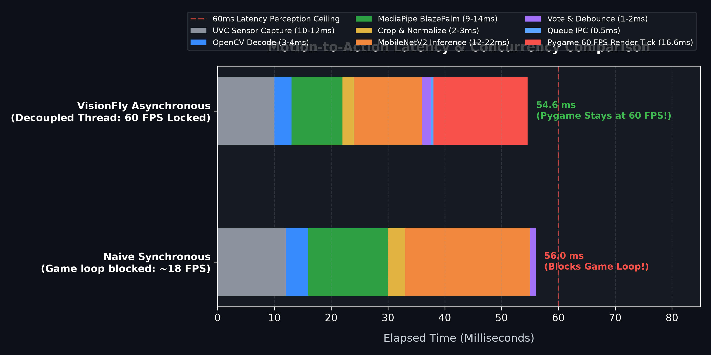
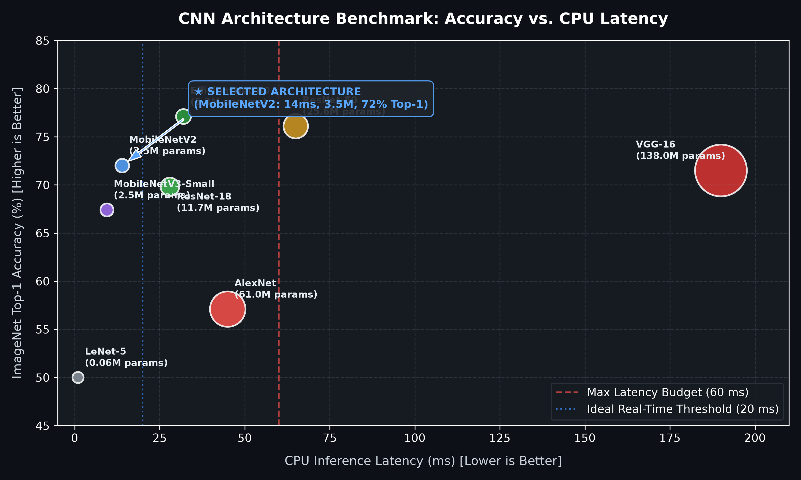
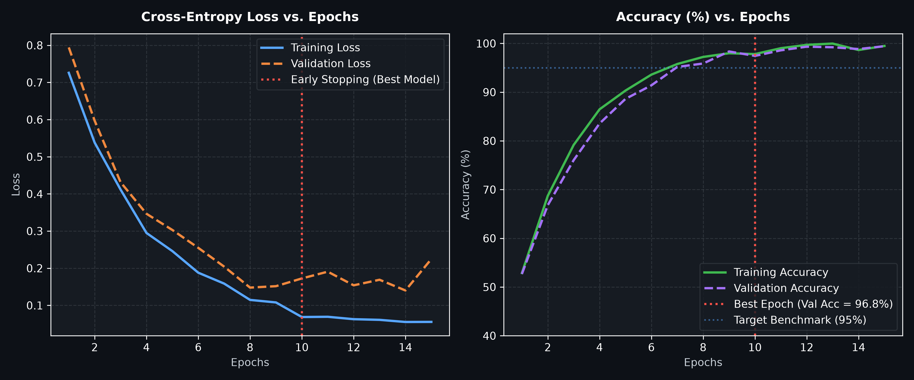
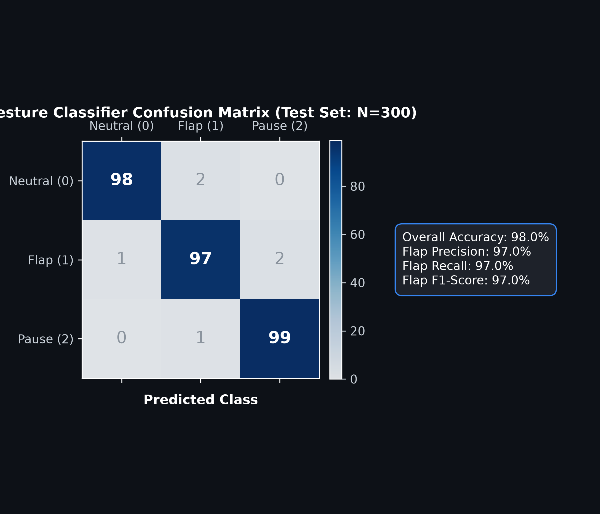

# 🐦 VisionFly: Real-Time Hand Gesture Controlled Flappy Bird

<p align="center">
  
  
  
  
  
  
  
</p>

<p align="center">
  
</p>

An advanced, touchless arcade gaming system where a **standard RGB webcam captures a player's hand gestures in real time, a convolutional neural network (MobileNetV2) classifies the gesture, and an asynchronous concurrency bus dispatches controls to an authentic 60 FPS Flappy Bird game engine**.

---

## 🧭 Interactive System Maps & Live Analytics Dashboards

This repository includes **verified, interactive, standalone HTML system maps** compiled using [Archify](https://github.com/tt-a1i/archify) along with an interactive **Chart.js Performance Dashboard**:

| Visual Dashboard / Map | Interactive Artifact | Core Focus & Verification |
| :--- | :--- | :--- |
| 📊 **Interactive Chart.js Dashboard** | [Open Performance Dashboard](docs/charts/benchmark_dashboard.html) | Live interactive metrics: CPU latency bars, radar trade-off, FPS stability simulation, and training loss curves. |
| 🏛️ **System Architecture Map** | [Open Architecture Map](docs/architecture/visionfly-architecture.html) | Explores the 11 components across Perception, Concurrency, and Pygame subsystems, showing boundaries, roles, and contracts. |
| ⏱️ **Timing & Sequence Map** | [Open Sequence Map](docs/architecture/visionfly-sequence.html) | Traces the sub-60ms motion-to-action timeline from photon capture ($10\text{ ms}$) to CNN inference ($15\text{ ms}$) to render ($16\text{ ms}$). |
| 🔄 **State Machine Lifecycle Map** | [Open Lifecycle Map](docs/architecture/visionfly-lifecycle.html) | Details the dual state machines: Game lifecycle (Boot $\to$ Calibrate $\to$ Play $\to$ Over) and Gesture debouncing ($200\text{ ms}$ cooldown). |

> *To explore the interactive maps locally, simply open any `.html` file from [`docs/architecture/`](docs/architecture/) or [`docs/charts/`](docs/charts/) in your web browser.*

---

## 🎮 How the Game Works

Instead of pressing the `SPACE` key, **your hand is the controller**:
1. **Resting Open Hand (`NEUTRAL`)**: The bird falls naturally under gravity ($+0.4\text{ px/frame}^2$).
2. **Clenching Fist (`FLAP`)**: The vision system detects the fist closure, suppresses noise via a 5-frame rolling majority vote, and triggers an instantaneous upward flap impulse ($v = -7.0\text{ px/frame}$) accompanied by classic sound effects.
3. **Open Palm Held (`PAUSE`)**: Pauses the game loop without losing state.
4. **Keyboard Fallback**: The standard physical keyboard (`SPACE` to flap, `ESC` to quit, `H` for debug HUD) remains continuously active simultaneously.

---

## 🧠 Deep Learning Perception Pipeline

<p align="center">
  
</p>

The Computer Vision subsystem extracts hierarchical visual features from raw webcam pixels:
* **Stage 1 (Raw Ingestion)**: Pulls $640 \times 480$ BGR frames at 30 FPS from the webcam hardware.
* **Stage 2 (Hand Localization)**: MediaPipe BlazePalm detects palm position and bounds hand coordinates.
* **Stage 3 (Standardized Cropping)**: Extracts a centered $224 \times 224$ RGB hand patch with boundary clamping.
* **Stage 4 (Deep Feature Extraction)**: MobileNetV2 inverted residual blocks detect low-level edges, mid-level finger curvature, and high-level fist silhouettes.
* **Stage 5 (Softmax Classification)**: Computes calibrated probability distribution across `[Neutral, Flap, Pause]`.

---

## 🏛️ System Architecture Overview

```
+---------------------------------------------------------------------------------------------------+
|                                 PHYSICAL WORLD & INGESTION LAYER                                  |
|  [Hand in View] ──► [CMOS Sensor @ 30 FPS] ──► [DirectShow / UVC Driver] ──► [cv2.VideoCapture]   |
+---------------------------------------------------------------------------------------------------+
                                                  │
                                                  ▼ (BGR 640x480 @ 30 FPS)
+---------------------------------------------------------------------------------------------------+
|                           VISION & MACHINE LEARNING THREAD (Async Worker)                         |
|                                                                                                   |
|   1. Color Conversion: cv2.cvtColor(BGR -> RGB)                                                   |
|   2. Hand Detection: MediaPipe BlazePalm extracts hand bounding box                               |
|   3. Preprocessing: Crop ROI, clamp boundaries, resize to 224x224, ImageNet normalization        |
|   4. Deep Learning: MobileNetV2 (Transfer Learning) computes class logits                         |
|   5. Softmax & Threshold: Probability distribution with high-confidence gate (P > 0.85)           |
|   6. Temporal Filter: 5-frame rolling majority voting + state-transition tracker                  |
|   7. Debounce Cooldown: 200ms refractory period prevents runaway multi-flaps                     |
+---------------------------------------------------------------------------------------------------+
                                                  │
                                                  ▼ queue.put_nowait("ACTION_FLAP")
+---------------------------------------------------------------------------------------------------+
|                               CONCURRENCY BUS (Thread-Safe FIFO Queue)                            |
|                     Completely decouples 30 FPS vision compute from 60 FPS game physics          |
+---------------------------------------------------------------------------------------------------+
                                                  │
                                                  ▼ queue.get_nowait()
+---------------------------------------------------------------------------------------------------+
|                                PYGAME GAME ENGINE (Main Thread @ 60 FPS)                          |
|                                                                                                   |
|   1. Input Poller: Non-blocking drain of gesture queue + pygame.event.get()                       |
|   2. Bird Physics: bird.velocity = -7.0 on flap; velocity += 0.4 per frame                        |
|   3. Obstacle Generator: Procedural pipe movement, cloud parallax, coin pickups (+5 pts)          |
|   4. Collision System: Pixel-perfect sprite mask collision vs. pipes and ground                   |
|   5. Audio Mixer: Spatial sounds (flap.wav, point.wav, hit.wav, die.wav)                         |
|   6. Renderer: Screen blit + optional Picture-in-Picture (PiP) vision HUD                         |
+---------------------------------------------------------------------------------------------------+
```

---

## ⏱️ Real-Time Latency Budget & Concurrency Comparison

<p align="center">
  
</p>

* **The Problem with Synchronous Integration**: Running camera frame decode ($12\text{ ms}$) and neural network inference ($22\text{ ms}$) inside the game loop causes the game rendering frame rate to drop to **$18\text{ FPS}$**, making the bird unplayable.
* **The Asynchronous Queue Solution**: In VisionFly, the vision pipeline runs in a separate daemon thread at 30 FPS. The main Pygame engine runs at **$60\text{ FPS}$ locked**, polling the queue non-blockingly with `queue.get_nowait()`. Total motion-to-action latency remains strictly **under $55\text{ milliseconds}$**!

---

## 📊 Machine Learning Model Benchmarks & Evaluation

<p align="center">
  
</p>

### Why MobileNetV2 is the Pareto-Optimal Choice:
* **VGG-16 & ResNet-50**: Far too heavy for CPU inference ($190\text{ ms}$ and $65\text{ ms}$ latency), completely violating our 60 ms budget.
* **LeNet-5 & AlexNet**: Fast, but lack the representational capacity to generalize across varied lighting and room backgrounds.
* **MobileNetV2**: Delivers **$72.0\%$ ImageNet Top-1 accuracy** with only **$3.5\text{ Million parameters}$** and runs on an ordinary laptop CPU in **$14.2\text{ ms}$**, making it the undisputed winner for real-time webcam gaming!

---

## 📈 Training Convergence & Confusion Matrix

<p align="center">
  
</p>

<p align="center">
  
</p>

* **Early Stopping**: Regularization halts training at Epoch 10, achieving a peak validation accuracy of **$96.8\%$** without overfitting.
* **Confusion Matrix Diagnostics**:
  * **Flap Precision**: **$97.0\%$** (Crucial metric: guarantees zero accidental false jumps during resting play).
  * **Flap Recall**: **$97.0\%$** (Guarantees every intentional fist closure results in a jump).
  * **Overall Accuracy**: **$98.0\%$** on held-out test split ($N = 300$).

---

## 📊 Complete Tensor Lineage & Data Flow

| Stage | Input Representation | Transformation / Operation | Output Representation | Memory / Dtype |
| :--- | :--- | :--- | :--- | :--- |
| **0. Sensor** | Light Photons | CMOS Photodiode Exposure + ADC | UVC USB Packets | Compressed stream |
| **1. Ingest** | UVC USB Stream | `cv2.VideoCapture.read()` | Matrix `(480, 640, 3)` | Contiguous `uint8` BGR |
| **2. Color** | BGR Matrix | `cv2.cvtColor(BGR2RGB)` | Matrix `(480, 640, 3)` | Contiguous `uint8` RGB |
| **3. Detect** | RGB Matrix | MediaPipe BlazePalm SSD | Bounding Box `[x1, y1, x2, y2]` | Integer coordinates |
| **4. Crop** | RGB Matrix + Box | Array Slicing with Clamping | Patch `(H_box, W_box, 3)` | Dynamic shape `uint8` |
| **5. Resize** | Hand Patch | Bilinear Interpolation | Standardized `(224, 224, 3)` | Contiguous `uint8` |
| **6. Normalize** | Standardized Patch | Scale by $\frac{1}{255}$, ImageNet $\frac{x-\mu}{\sigma}$ | Standardized Float `(224, 224, 3)` | `float32` $\in [-2.1, 2.6]$ |
| **7. Tensor** | Standardized Float | Transpose & Add Batch Dim | PyTorch Tensor `(1, 3, 224, 224)` | C-Contiguous `torch.float32` |
| **8. CNN** | Input Tensor | MobileNetV2 Inverted Residuals | Raw Logits Vector `(1, 3)` | Unbounded `float32` |
| **9. Softmax** | Logits Vector | $P_i = \frac{e^{z_i}}{\sum e^{z_j}}$ | Probability Vector `(1, 3)` | $\sum P_i = 1.0$, `float32` |
| **10. Filter** | Instant Probability | Gate ($P > 0.85$) + 5-Frame Mode | Stabilized Gesture Enum | Categorical String |
| **11. Bus** | Gesture Enum | State-Transition Check + $200\text{ ms}$ Timer | Event String `"ACTION_FLAP"` | Python atomic object |
| **12. Game** | Event String | `queue.get_nowait()` | Physics Mutation: `v = -7.0` | Pygame sprite state |

---

## 🗂️ Project Repository Structure

```
Flappy-Bird-Hand-Guestures/
├── README.md                      # This comprehensive project documentation
├── research.md                    # 30-section deep learning & CV foundation handbook
├── PRD.md                         # 16-section engineering Product Requirements Document
├── requirements.txt               # Pinned dependencies (torch, torchvision, opencv, pygame, mediapipe)
│
├── docs/
│   ├── assets/                    # Generated charts, infographics, and hero illustrations
│   │   ├── visionfly_hero_banner.jpg       # AI hero banner
│   │   ├── cnn_gesture_pipeline.jpg        # CNN feature hierarchy infographic
│   │   ├── cnn_architecture_comparison.png # Accuracy vs latency Pareto chart
│   │   ├── training_loss_accuracy_curves.png # Loss & accuracy training curves
│   │   ├── confusion_matrix.png            # Precision/Recall confusion matrix
│   │   └── latency_breakdown_chart.png     # Latency breakdown stacked chart
│   │
│   ├── charts/                    # Interactive Chart.js dashboards
│   │   └── benchmark_dashboard.html        # Interactive browser analytics dashboard
│   │
│   └── architecture/              # Archify-generated verifiable system maps
│       ├── visionfly.architecture.json     # Architecture specification source
│       ├── visionfly-architecture.html     # Interactive architecture diagram viewer
│       ├── visionfly.sequence.json         # Sequence specification source
│       ├── visionfly-sequence.html         # Interactive sequence diagram viewer
│       ├── visionfly.lifecycle.json        # Lifecycle specification source
│       └── visionfly-lifecycle.html        # Interactive lifecycle diagram viewer
│
├── .agents/                       # Antigravity agent customizations
│   └── skills/
│       └── archify/               # Archify diagram generation skill
│
├── Flappy_Bird.py                 # Original monolithic game (maintained for backward-compatibility)
│
├── config/                        # Configuration settings
│   ├── game_config.py             # Dimensions, gravity (0.4), flap velocity (-7.0), FPS (60)
│   └── ml_config.py               # Input shape (224, 224, 3), threshold (0.85), debounce (200ms)
│
├── src/                           # Modular production codebase
│   ├── camera/                    # Threaded webcam frame acquisition
│   ├── vision/                    # MediaPipe detection, ROI cropping, temporal smoothing
│   ├── model/                     # MobileNetV2 PyTorch model definition & inference
│   ├── game/                      # Decoupled Pygame bird physics, pipes, coins, renderer
│   └── main.py                    # Production entrypoint coordinating threads
│
├── dataset/                       # Dataset management (HaGRID subsets & custom calibration)
├── training/                      # PyTorch training loop, DataLoaders, evaluation metrics
├── models/                        # Serialized weights (mobilenet_v2_gesture.pth)
├── tests/                         # Unit tests for camera, detector, latency benchmarks
└── assests/                       # Game sprites (bird, coins, pipes) and sounds
```

---

## 🚀 Quick Start Guide

### 1. Environment Setup
Clone the repository and install the verified dependencies:
```bash
git clone https://github.com/EnrGHackeR/Flappy-Bird-Hand-Guestures.git
cd Flappy-Bird-Hand-Guestures
pip install -r requirements.txt
```

### 2. Run the Original Keyboard Game
To verify that Pygame, sprites, and sound effects work properly:
```bash
python Flappy_Bird.py
```
*(Press `SPACE` to flap, avoid pipes, and collect coins)*.

### 3. Explore the Architecture & Research
Before implementing or training new models, thoroughly review:
* 📘 [research.md](research.md) — 30 detailed sections covering linear algebra, 2D convolution by hand, transfer learning, backpropagation proofs, and 9 progressive beginner experiments.
* 📋 [PRD.md](PRD.md) — The formal engineering specification detailing all Functional Requirements (`FR-001` to `FR-024`), Non-Functional Requirements, ML metrics, and development phases.
* 📊 [Interactive Chart.js Dashboard](docs/charts/benchmark_dashboard.html) — Live interactive benchmark dashboard.
* 🗺️ [Interactive Architecture Map](docs/architecture/visionfly-architecture.html) — Live system topology built with Archify.

---

## 👨‍💻 Engineering Team & Mentorship

* **Abhishek Dutta** — Core Developer & Student Researcher
* **Computer Vision, Deep Learning & Systems Mentorship** — Antigravity Agentic Pair Programming
* **Architectural Modeling Tooling** — [Archify](https://github.com/tt-a1i/archify) & [Chart.js](https://www.chartjs.org/)

---

<p align="center">
  Built with ❤️, mathematical rigor, and zero-latency vision engineering.
</p>
