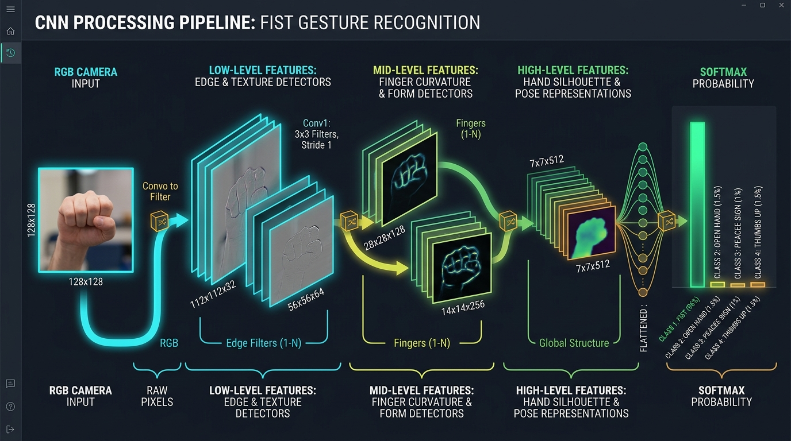
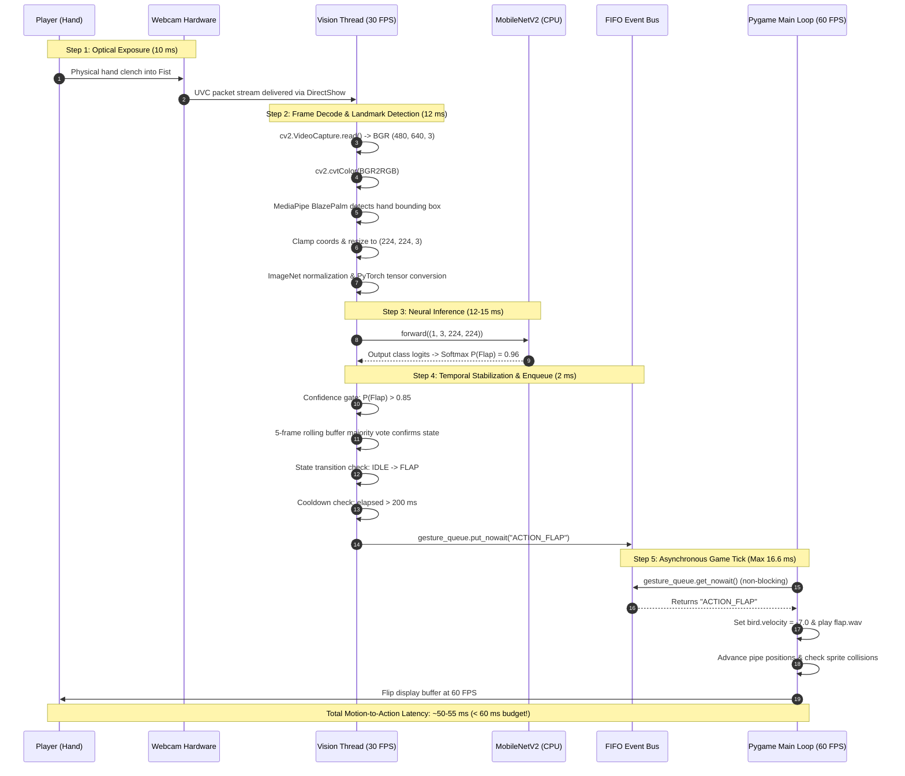
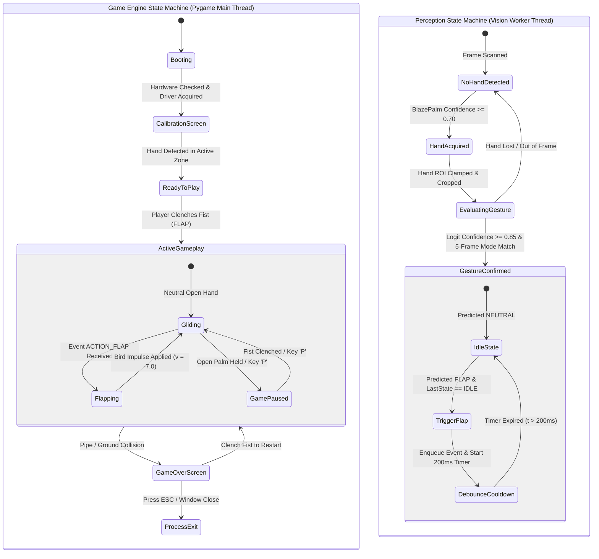

# VisionFly: Comprehensive Research and Technical Foundation Guide
## Hand Gesture Recognition for Real-Time Game Control

> **Authors / Project Mentors**: Computer Vision, Deep Learning & Systems Engineering Guidance  
> **Target Audience**: Abhishek Dutta & Samhita Mondal (Computer Science Students)  
> **Project Repository**: `Flappy-Bird-Hand-Guestures`  
> **Document Purpose**: Complete first-principles pedagogical guide, theoretical foundation, mathematical manual, literature survey, and architecture evaluation for building a real-time hand-gesture-controlled gaming system.

<p align="center">
  
</p>

---

## TABLE OF CONTENTS
1. [Section 1 — Project Overview](#section-1--project-overview)
2. [Section 2 — Required Background Knowledge](#section-2--required-background-knowledge)
3. [Section 3 — Image Processing Fundamentals](#section-3--image-processing-fundamentals)
4. [Section 4 — Webcam Pipeline & Hardware Interfacing](#section-4--webcam-pipeline--hardware-interfacing)
5. [Section 5 — Hand Detection & Localization Taxonomy](#section-5--hand-detection--localization-taxonomy)
6. [Section 6 — Convolutional Neural Networks (CNN) from First Principles](#section-6--convolutional-neural-networks-cnn-from-first-principles)
7. [Section 7 — CNN Architecture Survey & Benchmarking](#section-7--cnn-architecture-survey--benchmarking)
8. [Section 8 — Architecture Strategy: Scratch vs. Transfer Learning vs. Adaptation](#section-8--architecture-strategy-scratch-vs-transfer-learning-vs-adaptation)
9. [Section 9 — Hand Gesture Datasets Survey & Vocabulary Design](#section-9--hand-gesture-datasets-survey--vocabulary-design)
10. [Section 10 — Custom Dataset Collection & Engineering](#section-10--custom-dataset-collection--engineering)
11. [Section 11 — Data Augmentation Theory & Hand-Specific Pitfalls](#section-11--data-augmentation-theory--hand-specific-pitfalls)
12. [Section 12 — The Deep Learning Training Pipeline](#section-12--the-deep-learning-training-pipeline)
13. [Section 13 — Complete Mathematics of Model Training (Step-by-Step)](#section-13--complete-mathematics-of-model-training-step-by-step)
14. [Section 14 — Model Evaluation & Performance Diagnostics](#section-14--model-evaluation--performance-diagnostics)
15. [Section 15 — Real-Time Inference, Latency & Temporal Stabilization](#section-15--real-time-inference-latency--temporal-stabilization)
16. [Section 16 — Spatial CNNs vs. Temporal Models (RNN, LSTM, GRU)](#section-16--spatial-cnns-vs-temporal-models-rnn-lstm-gru)
17. [Section 17 — Vision Transformers (ViT) & Attention Mechanisms](#section-17--vision-transformers-vit--attention-mechanisms)
18. [Section 18 — Complete Architecture Options & Trade-Off Analysis](#section-18--complete-architecture-options--trade-off-analysis)
19. [Section 19 — Flappy Bird Integration & Concurrency Design](#section-19--flappy-bird-integration--concurrency-design)
20. [Section 20 — End-to-End System Architecture](#section-20--end-to-end-system-architecture)
21. [Section 21 — Technology Stack & Tool Ecosystem](#section-21--technology-stack--tool-ecosystem)
22. [Section 22 — Peer-Reviewed Literature & Research Paper Survey](#section-22--peer-reviewed-literature--research-paper-survey)
23. [Section 23 — Curated Academic & Technical Learning Resources](#section-23--curated-academic--technical-learning-resources)
24. [Section 24 — High-Quality Video Lecture Recommendations](#section-24--high-quality-video-lecture-recommendations)
25. [Section 25 — Step-by-Step Dependency Learning Roadmap](#section-25--step-by-step-dependency-learning-roadmap)
26. [Section 26 — Progressive Beginner Experiments (Phase 0)](#section-26--progressive-beginner-experiments-phase-0)
27. [Section 27 — Failure Modes, Edge Cases & Troubleshooting Guide](#section-27--failure-modes-edge-cases--troubleshooting-guide)
28. [Section 28 — Ethical, Privacy, and Legal Considerations](#section-28--ethical-privacy-and-legal-considerations)
29. [Section 29 — Practical Research Gaps & Novelty Exploration](#section-29--practical-research-gaps--novelty-exploration)
30. [Section 30 — Final First-Principles Knowledge Checklist](#section-30--final-first-principles-knowledge-checklist)

---

# SECTION 1 — PROJECT OVERVIEW

### 1.1 The Core Problem & The Engineering Challenge
In standard computer gaming, input signals are binary, instantaneous, and deterministic: pressing the `SPACE` key on a keyboard sends an electrical interrupt to the operating system, which is dispatched to the game process in less than 2 milliseconds.

In this project, we replace this mechanical switch with a **Computer Vision (CV) and Deep Learning (DL)** pipeline:
1. Photons hit an off-the-shelf CMOS webcam sensor.
2. The webcam delivers a stream of 2D pixel grids (video frames) into system memory.
3. Machine learning algorithms process these grids to detect whether a human hand is present.
4. If present, a neural network interprets the visual spatial pattern (the geometric configuration of fingers and palm) to categorize it into a specific gesture (e.g., "Fist", "Open Palm", "Thumbs Up").
5. The detected gesture is filtered, debounced, and translated into a discrete game control command (e.g., trigger bird flap, pause, restart).
6. The existing Pygame engine receives this command, adjusts the physical velocity of the bird sprite, recalculates collisions against oncoming pipes, and renders the updated state on screen.

The central engineering challenge is that **computer vision is continuous, noisy, probabilistic, and computationally intensive**, whereas **Flappy Bird requires millisecond-accurate, low-latency, and zero-false-positive control**. If our vision pipeline takes 120 milliseconds to process a frame or misclassifies an open palm as a fist every few seconds, the bird crashes and the game becomes unplayable.

### 1.2 Step-by-Step Physical Journey: From Photon to Flapping Bird

```
+---------------------------------------------------------------------------------------------------+
|                                 PHYSICAL REALITY & HARDWARE                                       |
|  [Hand in Air] ---> Light bounces off skin ---> Lens ---> CMOS Sensor photodiode matrix           |
+---------------------------------------------------------------------------------------------------+
                                                  |
                                                  v
+---------------------------------------------------------------------------------------------------+
|                                OPERATING SYSTEM & DRIVERS                                         |
|  Analog Voltages ---> ADC (Analog-to-Digital Converter) ---> USB Stream (UVC Driver)              |
+---------------------------------------------------------------------------------------------------+
                                                  |
                                                  v
+---------------------------------------------------------------------------------------------------+
|                                   OPENCV INGESTION LAYER                                          |
|  cv2.VideoCapture() pulls frame buffer ---> Decodes compressed MJPEG/YUYV                         |
|  Outputs raw NumPy Array: shape (H, W, C) = (480, 640, 3) in BGR format                          |
+---------------------------------------------------------------------------------------------------+
                                                  |
                                                  v
+---------------------------------------------------------------------------------------------------+
|                                HAND LOCALIZATION / ROI EXTRACTION                                 |
|  Full image is scanned for hand presence (via MediaPipe Hand Detector or YOLO/SSD)                |
|  Extracts Bounding Box [x_min, y_min, x_max, y_max] or 21 Landmark Coordinates (x, y, z)          |
+---------------------------------------------------------------------------------------------------+
                                                  |
                                                  v
+---------------------------------------------------------------------------------------------------+
|                                     IMAGE PREPROCESSING                                           |
|  Crop hand Region of Interest (ROI) ---> Resize to fixed shape (e.g., 224x224)                    |
|  Convert BGR to RGB ---> Normalize pixel intensities from [0, 255] to [0.0, 1.0] or [-1.0, 1.0]   |
|  Format as PyTorch/TensorFlow Tensor with Batch Dimension: (1, 3, 224, 224)                       |
+---------------------------------------------------------------------------------------------------+
                                                  |
                                                  v
+---------------------------------------------------------------------------------------------------+
|                                 DEEP LEARNING MODEL (CNN)                                         |
|  Forward Pass: Convolutional filters detect edges, textures, finger shapes, palm contour          |
|  Pooling reduces spatial dimension ---> Dense layers compute class logits                         |
|  Softmax function converts logits to probability distribution: e.g., [Fist: 0.94, Palm: 0.04...]  |
+---------------------------------------------------------------------------------------------------+
                                                  |
                                                  v
+---------------------------------------------------------------------------------------------------+
|                               TEMPORAL SMOOTHING & DEBOUNCING                                     |
|  Rolling window / Ring buffer of last N predictions (e.g., N=5 frames)                            |
|  Enforce confidence threshold (p > 0.80) & State Transition Debounce (ignore transient noise)     |
|  Identifies valid state change: e.g., "IDLE" -> "FLAP TRIGGERED"                                  |
+---------------------------------------------------------------------------------------------------+
                                                  |
                                                  v
+---------------------------------------------------------------------------------------------------+
|                                 GAME INTERFACE / EVENT BUS                                        |
|  Thread-safe Queue passes "ACTION_FLAP" event to Pygame main loop                                 |
+---------------------------------------------------------------------------------------------------+
                                                  |
                                                  v
+---------------------------------------------------------------------------------------------------+
|                                     PYGAME ENGINE                                                 |
|  game_loop checks event queue ---> Sets bird.velocity = -7.0 ---> Plays flap.wav                  |
|  Bird coordinates update ---> Collision detection runs ---> Frame renders at 60 FPS               |
+---------------------------------------------------------------------------------------------------+
```

---

# SECTION 2 — REQUIRED BACKGROUND KNOWLEDGE

To build this system without treating the deep learning libraries as "black magic", you must understand the mathematical language models use to represent data and optimize their internal parameters.

### 2.1 Linear Algebra & Tensor Fundamentals

#### Scalars
* **Intuition**: A single number representing a quantity or magnitude with no direction.
* **Numerical Example**: $s = 0.85$ (e.g., the model's prediction confidence score for "Fist").
* **Role in Project**: Confidence thresholds, learning rate ($\alpha = 0.001$), bird gravity ($g = 0.4$), bird velocity ($v = -7.0$).
* **Resource**: [Khan Academy - Precalculus: Scalars and Vectors](https://www.khanacademy.org/math/precalculus/x9e81a4f983816e3:vectors).

#### Vectors
* **Intuition**: An ordered 1D array of numbers with both magnitude and direction. In computer science, an array indexed by one subscript.
* **Numerical Example**: $\mathbf{v} = [0.02, 0.91, 0.07]^T$ representing predicted probabilities across 3 gesture classes (`[Palm, Fist, ThumbsUp]`).
* **Role in Project**: Output probability vectors from Softmax, 1D feature embeddings, 21 landmark coordinate vectors $(x, y, z)$.
* **Resource**: [3Blue1Brown - Essence of Linear Algebra (Chapter 1: Vectors)](https://www.3blue1brown.com/lessons/vectors).

#### Matrices
* **Intuition**: A 2D grid of numbers organized into rows and columns ($M \times N$).
* **Numerical Example**: A tiny $3 \times 3$ grayscale patch:
  $$A = \begin{bmatrix} 255 & 128 & 0 \\ 200 & 90 & 10 \\ 150 & 40 & 0 \end{bmatrix}$$
* **Role in Project**: Single-channel grayscale images, weight matrices connecting fully-connected layers in a neural network.
* **Resource**: [3Blue1Brown - Linear Transformations and Matrices](https://www.3blue1brown.com/lessons/linear-transformations).

#### Tensors
* **Intuition**: A generalized multi-dimensional array of numbers. A scalar is a 0D tensor, a vector is a 1D tensor, a matrix is a 2D tensor, an RGB color image is a 3D tensor, and a batch of images is a 4D tensor.
* **Numerical Example**: A mini-batch of 32 color images, each of size $224 \times 224$ pixels with 3 color channels (Red, Green, Blue), has shape $(32, 3, 224, 224)$ in PyTorch convention (`Batch, Channels, Height, Width`).
* **Role in Project**: The primary data container passed between layers in PyTorch or TensorFlow.
* **Resource**: [PyTorch Official Documentation: Tensors](https://pytorch.org/tutorials/beginner/basics/tensorqs_tutorial.html).

#### Dot Product
* **Intuition**: An algebraic operation that multiplies matching components of two equal-length vectors and sums them up. It measures how much two vectors point in the same direction.
* **Numerical Example**:
  $$\mathbf{a} = [1, 2, 3], \quad \mathbf{b} = [4, 5, 6]$$
  $$\mathbf{a} \cdot \mathbf{b} = (1 \times 4) + (2 \times 5) + (3 \times 6) = 4 + 10 + 18 = 32$$
* **Role in Project**: The basic atomic arithmetic operation inside every artificial neuron: multiplying inputs $\mathbf{x}$ by weights $\mathbf{w}$ plus bias $b$: $z = \mathbf{w} \cdot \mathbf{x} + b$.
* **Resource**: [Khan Academy - Vector Dot Product](https://www.khanacademy.org/math/linear-algebra/vectors-and-spaces/dot-and-cross-products/v/vector-dot-product-and-vector-length).

#### Matrix Multiplication
* **Intuition**: Multiplying rows of matrix $A$ by columns of matrix $B$. Matrix $A$ of shape $(M \times K)$ multiplied by matrix $B$ of shape $(K \times N)$ yields matrix $C$ of shape $(M \times N)$.
* **Numerical Example**:
  $$\begin{bmatrix} 1 & 2 \\ 3 & 4 \end{bmatrix} \begin{bmatrix} 5 & 6 \\ 7 & 8 \end{bmatrix} = \begin{bmatrix} (1 \cdot 5 + 2 \cdot 7) & (1 \cdot 6 + 2 \cdot 8) \\ (3 \cdot 5 + 4 \cdot 7) & (3 \cdot 6 + 4 \cdot 8) \end{bmatrix} = \begin{bmatrix} 19 & 22 \\ 43 & 50 \end{bmatrix}$$
* **Role in Project**: Fully connected layers (`nn.Linear`) compute $\mathbf{Y} = \mathbf{X}\mathbf{W}^T + \mathbf{b}$ for all samples in a batch simultaneously.
* **Resource**: [3Blue1Brown - Matrix Multiplication as Composition](https://www.3blue1brown.com/lessons/matrix-multiplication).

---

### 2.2 Calculus & Optimization Fundamentals

#### Functions, Derivatives & Slopes
* **Intuition**: A function $f(x)$ maps an input $x$ to an output $y$. The derivative $f'(x) = \frac{df}{dx}$ measures the instantaneous rate of change (the slope of the tangent line). A positive slope means $y$ increases as $x$ increases; a negative slope means $y$ decreases as $x$ increases.
* **Numerical Example**: For $f(x) = x^2$, the derivative is $\frac{df}{dx} = 2x$. At $x = 3$, slope $= 6$. At $x = -2$, slope $= -4$.
* **Role in Project**: Tells our learning algorithm whether increasing or decreasing a neural network weight will increase or decrease the error (loss).
* **Resource**: [Khan Academy - Differential Calculus](https://www.khanacademy.org/math/differential-calculus).

#### Partial Derivatives & Gradients
* **Intuition**: In a function with millions of variables (weights), a partial derivative $\frac{\partial f}{\partial w_i}$ measures how $f$ changes when we vary *only* $w_i$ while holding all other weights constant. The **gradient** $\nabla f$ is a vector containing all these partial derivatives. It points in the direction of steepest ascent.
* **Numerical Example**: Let $f(x, y) = 3x^2 + 2y^3$.
  $$\frac{\partial f}{\partial x} = 6x, \quad \frac{\partial f}{\partial y} = 6y^2$$
  At point $(1, 2)$: $\nabla f = \left[\frac{\partial f}{\partial x}, \frac{\partial f}{\partial y}\right]^T = [6(1), 6(2^2)]^T = [6, 24]^T$.
* **Role in Project**: Backpropagation calculates the gradient of the loss function with respect to every weight in our CNN.
* **Resource**: [3Blue1Brown - Essence of Calculus (Chapter 2 & 3)](https://www.3blue1brown.com/topics/calculus).

#### The Chain Rule
* **Intuition**: If variable $z$ depends on $y$, and $y$ depends on $x$, then the rate of change of $z$ with respect to $x$ is the product of the individual rates: $\frac{dz}{dx} = \frac{dz}{dy} \cdot \frac{dy}{dx}$.
* **Numerical Example**: Let $y = 3x + 1$ and $z = y^2$.
  $$\frac{dy}{dx} = 3, \quad \frac{dz}{dy} = 2y$$
  $$\frac{dz}{dx} = \frac{dz}{dy} \cdot \frac{dy}{dx} = 2y \cdot 3 = 6(3x + 1) = 18x + 6$$
* **Role in Project**: Deep networks are chains of composite functions $f_L(f_{L-1}(...f_1(\mathbf{x})))$. The chain rule is the mathematical foundation of the Backpropagation algorithm.
* **Resource**: [Khan Academy - Chain Rule](https://www.khanacademy.org/math/ap-calculus-ab/ab-differentiation-2-new/ab-2-8/v/chain-rule-introduction).

#### Gradient Descent
* **Intuition**: An iterative algorithm to find the minimum of a loss function. Imagine standing on a foggy hill wearing a blindfold. To find the valley bottom, you feel the slope of the ground under your feet with your foot, and take a small step in the direction of the steepest downward slope.
* **Mathematical Formula**:
  $$w_{\text{new}} = w_{\text{old}} - \alpha \cdot \frac{\partial L}{\partial w}$$
  where $\alpha$ is the learning rate (step size), and $\frac{\partial L}{\partial w}$ is the gradient.
* **Numerical Example**: Let current weight $w = 5.0$, learning rate $\alpha = 0.1$, and current gradient $\frac{\partial L}{\partial w} = 4.0$.
  $$w_{\text{new}} = 5.0 - (0.1 \times 4.0) = 5.0 - 0.4 = 4.6$$
  The weight has moved in the direction that reduces the error.
* **Resource**: [Stanford CS231n - Optimization: Stochastic Gradient Descent](https://cs231n.github.io/optimization-1/).

---

### 2.3 Statistics & Probability Fundamentals

#### Probability & Probability Distributions
* **Intuition**: A probability $P(A) \in [0, 1]$ expresses the degree of certainty of an event. A discrete probability distribution lists the probabilities of all mutually exclusive outcomes such that their sum equals exactly 1.0.
* **Numerical Example**: A 3-class gesture prediction: $P(\text{Fist}) = 0.85$, $P(\text{Palm}) = 0.10$, $P(\text{Neutral}) = 0.05$. Sum $= 0.85 + 0.10 + 0.05 = 1.00$.
* **Role in Project**: Model outputs converted via Softmax represent a categorical probability distribution over our defined gesture vocabulary.

#### Mean and Variance
* **Intuition**:
  * **Mean ($\mu$)**: The expected value or arithmetic center of a set of numbers.
  * **Variance ($\sigma^2$)**: How spread out the numbers are around the mean. Standard deviation $\sigma = \sqrt{\sigma^2}$.
* **Numerical Example**: Pixel values: $[10, 20, 30, 40, 50]$.
  $$\mu = \frac{10 + 20 + 30 + 40 + 50}{5} = 30$$
  $$\sigma^2 = \frac{(10-30)^2 + (20-30)^2 + (30-30)^2 + (40-30)^2 + (50-30)^2}{5} = \frac{400 + 100 + 0 + 100 + 400}{5} = 200$$
  $$\sigma = \sqrt{200} \approx 14.14$$
* **Role in Project**: Batch Normalization layers in CNNs and image standardization pipelines use mean and variance to stabilize neural network training.

#### Normalization / Standardization
* **Intuition**: Rescaling features so that they share a common scale (e.g., $[0, 1]$ or mean 0, variance 1). Raw images have integer pixel intensities from 0 to 255. If unnormalized, large input values cause gradients to explode or saturate activation functions.
* **Formula (Min-Max)**:
  $$x_{\text{norm}} = \frac{x - 0}{255 - 0} = \frac{x}{255.0}$$
* **Numerical Example**: Pixel value $x = 128 \implies x_{\text{norm}} = \frac{128}{255} \approx 0.5019$.

---

# SECTION 3 — IMAGE PROCESSING FUNDAMENTALS

### 3.1 What is a Digital Image?
To a human eye, an image is a continuous field of colors, shadows, and contours. To a computer, a digital image is nothing more than a **two-dimensional rectangular grid of numbers**, called **pixels** (picture elements).

Each pixel represents the measured light intensity at that discrete spatial coordinate $(x, y)$.

### 3.2 Color Spaces and Channels

```
     Grayscale Image: (H, W)                  RGB Color Image: (H, W, 3)
           Width = 4                                 Width = 4
       +----+----+----+----+                    +----+----+----+----+
     0 | 45 | 48 | 52 | 50 |                  0 | R  | R  | R  | R  |  Layer 0: Red Channel
       +----+----+----+----+                    +----+----+----+----+
H    1 | 90 | 95 |102 | 98 |               H  1 | G  | G  | G  | G  |  Layer 1: Green Channel
e      +----+----+----+----+               e    +----+----+----+----+
i    2 |180 |185 |190 |182 |               i  2 | B  | B  | B  | B  |  Layer 2: Blue Channel
g      +----+----+----+----+               g    +----+----+----+----+
h    3 |240 |245 |250 |248 |               h  3
t      +----+----+----+----+               t
   Single 2D Matrix (0 to 255)                  Three stacked 2D Matrices
```

#### Grayscale (1 Channel)
* Represents brightness only (luminance).
* Values range from `0` (pitch black) to `255` (pure white) stored as 8-bit unsigned integers (`uint8`).
* Shape: $(H, W)$ or $(H, W, 1)$.

#### RGB (3 Channels: Red, Green, Blue)
* Standard representation in digital displays and web technologies.
* Any color is formed by additive mixing of Red, Green, and Blue light:
  * Pure Red: `(255, 0, 0)`
  * Pure Green: `(0, 255, 0)`
  * Pure Blue: `(0, 0, 255)`
  * Yellow: `(255, 255, 0)`
  * White: `(255, 255, 255)`
  * Black: `(0, 0, 0)`

#### The OpenCV Gotcha: BGR vs. RGB
* **Critical Trap**: When OpenCV loads an image (`cv2.imread`) or grabs a frame from a webcam (`cap.read()`), it stores color channels in **BGR (Blue, Green, Red)** order due to historical hardware conventions in early video capture cards.
* However, **Matplotlib, PyTorch, torchvision, and MediaPipe** expect standard **RGB** order!
* If you pass a BGR image directly to a PyTorch model pretrained on ImageNet:
  * The Red channel will be processed by weights trained to detect Blue patterns.
  * The Blue channel will be processed by weights trained to detect Red patterns.
  * Skin tones (which are rich in Red and Green) will appear alien Blue to the network, destroying classification accuracy.
* **Mandatory Conversion**:
  ```python
  import cv2
  rgb_frame = cv2.cvtColor(bgr_frame, cv2.COLOR_BGR2RGB)
  ```

### 3.3 Deconstructing the $224 \times 224 \times 3$ Image Tensor
Standard vision models (like MobileNet, ResNet, VGG) require a standardized input size, commonly $224 \times 224 \times 3$. What does this mean physically?

1. **Height ($H = 224$)**: The vertical resolution of the input patch (224 rows of pixels from top to bottom).
2. **Width ($W = 224$)**: The horizontal resolution of the input patch (224 columns of pixels from left to right).
3. **Channels ($C = 3$)**: Three 2D arrays stacked along the depth axis (Red, Green, Blue).
4. **Total Numbers**: $224 \times 224 \times 3 = 150,528$ individual values representing one single hand image.

#### Memory Layout Conventions: HWC vs. CHW
* **OpenCV / NumPy / TensorFlow**: Use **Channels-Last** format: `(Height, Width, Channels)` $\implies (224, 224, 3)$.
* **PyTorch**: Uses **Channels-First** format: `(Channels, Height, Width)` $\implies (3, 224, 224)$.
* **Batch Dimension**: Neural networks never process unbatched single images during vectorized execution. A batch of size 1 becomes `(1, 3, 224, 224)` in PyTorch or `(1, 224, 224, 3)` in TensorFlow.

### 3.4 Essential Image Preprocessing Operations

#### 1. Resizing (Interpolation)
When downscaling a $480 \times 640$ webcam frame or a cropped hand region of $180 \times 150$ to $224 \times 224$, pixel values must be recalculated:
* **Nearest Neighbor**: Fast, but produces blocky artifacts.
* **Bilinear Interpolation** (`cv2.INTER_LINEAR`): Default, smooth blend of neighboring 4 pixels. Ideal for downsampling/upsampling.
* **Bicubic / Area** (`cv2.INTER_AREA`): Best for downsampling without aliasing moiré patterns.

#### 2. Cropping (Region of Interest - ROI)
Isolating the sub-matrix that contains only the hand from the entire room background:
```python
# Slicing a NumPy 2D/3D array: frame[y_min:y_max, x_min:x_max]
hand_roi = frame[ymin:ymax, xmin:xmax]
```
Cropping discards irrelevant visual noise (posters on walls, books, shirts, shadows), allowing the CNN to focus 100% of its parameters on finger configurations.

#### 3. Normalization & Standardization
Raw pixel data in memory: `uint8` integers $\in [0, 255]$.
* Step 1: Scale to float in $[0.0, 1.0]$:
  $$\mathbf{x}_{\text{float}} = \frac{\mathbf{x}}{255.0}$$
* Step 2: Standardize with ImageNet dataset statistics ($\mu = [0.485, 0.456, 0.406]$, $\sigma = [0.229, 0.224, 0.225]$):
  $$\mathbf{x}_{\text{standardized}} = \frac{\mathbf{x}_{\text{float}} - \mu}{\sigma}$$
This centers the data around zero, preventing vanishing/exploding gradients during backpropagation.

---

# SECTION 4 — WEBCAM PIPELINE & HARDWARE INTERFACING

### 4.1 Physical Hardware to Software Memory

```
+------------------+         +--------------------+         +-------------------+
|  Camera Hardware |  Light  |  USB Controller /  | UVC raw | OS Kernel & UVC   |
|  CMOS Sensor     | ======> |  ASIC Encoder      | ======> | Device Driver     |
|  Photodiode Array|         |  (MJPEG / YUY2)    | Stream  | (V4L2 / DirectShow|
+------------------+         +--------------------+         +-------------------+
                                                                      |
                                                              Buffer | Ring Queue
                                                                      v
+------------------+         +--------------------+         +-------------------+
| Python Runtime   | NumPy   | OpenCV             | C-API   | OpenCV C++ Core   |
| In-Memory Array  | <====== | cv2.VideoCapture   | <====== | VideoCapture      |
| (480, 640, 3)    |         | .read() method     | Frame   | Decoding Engine   |
+------------------+         +--------------------+         +-------------------+
```

1. **CMOS Sensor**: Contains millions of light-sensitive photodiodes covered with a Bayer color filter pattern (RGBG). When the camera shutter opens, photons hit the photodiodes, accumulating electrical charges proportional to light intensity.
2. **Onboard Camera ASIC**: An analog-to-digital converter (ADC) converts these voltages into digital numbers, applies auto-white-balance (AWB) and auto-exposure (AE), compresses the raw frames into an encoded stream (such as **MJPEG** or uncompressed **YUYV/YUY2**), and transmits them over the USB bus via the standard **USB Video Class (UVC)** protocol.
3. **Operating System Driver**: On Windows, Microsoft DirectShow or Media Foundation receives the USB packets and populates an internal kernel-level frame buffer.
4. **OpenCV VideoCapture**: OpenCV binds to the OS video subsystem (DirectShow `cv2.CAP_DSHOW` or MSMF on Windows), requests the latest frame from the kernel buffer, decompresses the image into uncompressed 24-bit BGR format, and allocates a contiguous C-memory block.
5. **NumPy Array Creation**: Python receives a zero-copy pointer wrapped as a standard `numpy.ndarray` of dtype `uint8` and shape `(480, 640, 3)`.

### 4.2 Critical Real-Time Metrics: FPS, Resolution & Latency
* **Frame Rate (FPS)**: Number of discrete frames captured per second. Standard webcams operate at 30 FPS, meaning a new frame arrives every:
  $$\Delta t_{\text{capture}} = \frac{1000\text{ ms}}{30} \approx 33.33\text{ ms}$$
* **Resolution Trade-Off**:
  * High resolution ($1920 \times 1080 = 2,073,600$ pixels): High detail, but massive USB transfer bandwidth, high decoding overhead, and slow processing.
  * Low/Standard resolution ($640 \times 480 = 307,200$ pixels): Fast decoding ($< 3\text{ ms}$), minimal memory footprint, and more than enough visual information for hand detection.
* **Latency Budget**: Total end-to-end latency is the sum of every sequential step:
  $$T_{\text{total}} = T_{\text{capture}} + T_{\text{read}} + T_{\text{detect}} + T_{\text{preprocess}} + T_{\text{inference}} + T_{\text{smooth}} + T_{\text{game\_tick}}$$
  For Flappy Bird to feel snappy and responsive, $T_{\text{total}}$ must remain strictly **under 60–80 milliseconds**. If $T_{\text{total}} > 150\text{ ms}$, the player will perceive a noticeable delay between flicking their hand and the bird jumping, making narrow pipe passages impossible to clear.

---

# SECTION 5 — HAND DETECTION & LOCALIZATION TAXONOMY

A major point of confusion for beginners is mixing up **Hand Detection**, **Hand Localization**, **Landmark Detection**, and **Gesture Classification**. Let us strictly define these computer vision concepts.

```
1. Hand Detection / Localization        2. Hand Landmark Detection            3. Hand Segmentation
+-----------------------------+        +-----------------------------+        +-----------------------------+
|                             |        |                             |        |      ..:::::::..            |
|       +--------------+      |        |          *   *   *          |        |    .:::::::::::::.          |
|       | Bounding Box |      |        |           \  |  /           |        |   :::::::::::::::::         |
|       |   [x1, y1,   |      |        |        *---* * *---*        |        |   :::::::::::::::::         |
|       |    x2, y2]   |      |        |             \|/             |        |    ':::::::::::::'          |
|       +--------------+      |        |              * (21 points)  |        |      ':::::::::'            |
|                             |        |                             |        |                             |
+-----------------------------+        +-----------------------------+        +-----------------------------+
  Output: 4 coordinates (Box)            Output: 21 (x, y, z) points            Output: Pixel-level mask
```

### 5.1 Concept Clarification
* **Hand Detection**: Answering the binary question: *"Is there a hand in this image, and where is it roughly located?"* The output is a **Bounding Box** defined by 4 coordinates: $[x_{\text{min}}, y_{\text{min}}, x_{\text{max}}, y_{\text{max}}]$ along with a detection confidence score (e.g., $0.96$).
* **Hand Localization**: Synonymous with bounding box estimation; finding the spatial bounding coordinates of the object within the larger frame.
* **Hand Segmentation**: Pixel-level binary classification. Every single pixel in the image is classified as either `1` (part of the hand) or `0` (background). Computationally expensive and rarely needed for game control.
* **Hand Landmark / Keypoint Detection**: Regressing the exact 2D or 3D coordinates of specific anatomical joints of the hand skeleton (e.g., wrist, thumb base, thumb tip, index tip, pinky knuckle). MediaPipe detects **21 distinct 3D landmarks**.
* **Gesture Classification**: Categorizing an already detected hand into a discrete semantic category (e.g., `"FIST"`, `"OPEN_PALM"`, `"THUMBS_UP"`).

### 5.2 Comparative Analysis of Hand Detection Techniques

| Technique | Mechanism | Advantages | Critical Weaknesses / Failure Modes | Real-Time Feasibility |
| :--- | :--- | :--- | :--- | :--- |
| **Skin-Color Segmentation** | Converts BGR to HSV/YCbCr color space; thresholds skin-tone range ($H \in [0, 20]$, $S \in [30, 150]$). | Extremely fast ($< 1\text{ ms}$); no GPU required; simple code. | Completely breaks if background has wooden furniture, beige walls, or faces; fails across diverse ethnic skin tones and changing room lighting. | 60+ FPS |
| **Haar Cascades** | Viola-Jones algorithm using boosted cascades of simple rectangular edge/line features. | Very low CPU usage; historically popular in OpenCV. | Rigid; fails if hand is rotated, tilted, or partially closed; high false-positive rate. | 40+ FPS |
| **Contour Analysis** | Thresholds image to binary mask, finds convex hull and convexity defects (spaces between fingers). | Intuitive geometric interpretation of open fingers. | Requires pristine, noise-free segmentation mask; utterly unusable with real-world cluttered backgrounds. | 40+ FPS |
| **YOLO / SSD Hand Detectors** | Deep convolutional single-stage object detector trained on bounding boxes (e.g., YOLOv8-hand). | Extremely robust to complex backgrounds, lighting changes, scale, and partial occlusions. | Heavy compute footprint; requires dedicated GPU or quantized ONNX runtime to reach 30 FPS on CPU. | 15–35 FPS |
| **MediaPipe Hands (BlazePalm + Landmark)** | Two-stage pipeline: (1) BlazePalm SSD finds palm box; (2) Hand Landmark model regresses 21 3D points inside box. | State-of-the-art accuracy, real-time on ordinary CPU ($>30\text{ FPS}$), robust across skin tones, outputs rich 3D skeleton coordinates. | Pretrained on single or dual hands; requires proper lighting; hand must be clearly visible. | 30–60 FPS |

### 5.3 The Two-Stage Architecture Paradigm
Why do modern systems almost universally use a **Pretrained Hand Detector** before passing data to a gesture model?
1. **Translation Invariance & Spatial Focus**: If your user moves their hand from the bottom-left corner of the webcam frame to the top-right corner, a raw CNN trying to classify the entire $480 \times 640$ frame has to learn to recognize gestures in every possible spatial location. By using a hand detector to crop out *just the hand* into a centered $224 \times 224$ image, the classifier only needs to learn hand shapes, not room backgrounds!
2. **Dataset Size Efficiency**: Training a CNN from scratch on whole webcam frames requires tens of thousands of images across diverse rooms. Training a CNN on cropped hand patches requires only hundreds of images per class.

---

# SECTION 6 — CONVOLUTIONAL NEURAL NETWORKS (CNN) FROM FIRST PRINCIPLES

### 6.1 Why Fully Connected (Dense) Networks Fail for Images
In a classic Multilayer Perceptron (MLP), every input neuron connects to every hidden neuron.
Suppose we feed a modest $224 \times 224 \times 3$ image into a dense layer with 1,000 hidden units:
* Number of inputs: $224 \times 224 \times 3 = 150,528$.
* Number of weights in the first layer alone: $150,528 \times 1,000 = \mathbf{150,528,000}$ (over 150 million parameters!).
* **Consequences**:
  1. Massive memory consumption.
  2. Severe overfitting (the model memorizes training images instead of learning general patterns).
  3. Complete lack of **spatial awareness**: If you shift the hand 5 pixels to the right, all 150,528 inputs change, and a dense network fails to recognize it as the same hand.

### 6.2 The Solution: Convolution, Weight Sharing, and Local Receptive Fields
A Convolutional Neural Network introduces two biological principles:
1. **Local Receptive Fields**: A neuron only connects to a tiny spatial neighborhood of pixels (e.g., a $3 \times 3$ patch) rather than the whole image.
2. **Weight Sharing (Kernel/Filter)**: The exact same small set of weights ($3 \times 3 = 9$ weights) slides across the entire image. If a filter learns to detect a vertical skin edge in the top-left corner, it can detect that same vertical skin edge anywhere in the frame!

### 6.3 Step-by-Step Convolution Mathematics (Numerical Example)
Let us calculate a 2D convolution by hand with real numbers.
Suppose we have a $5 \times 5$ single-channel image patch $I$ and a $3 \times 3$ edge-detection kernel $K$:

$$I = \begin{bmatrix}
10 & 10 & 10 & 0 & 0 \\
10 & 10 & 10 & 0 & 0 \\
10 & 10 & 10 & 0 & 0 \\
10 & 10 & 10 & 0 & 0 \\
10 & 10 & 10 & 0 & 0
\end{bmatrix}, \quad
K = \begin{bmatrix}
-1 & 0 & 1 \\
-1 & 0 & 1 \\
-1 & 0 & 1
\end{bmatrix}, \quad \text{Bias } b = 0$$

Notice that image $I$ has bright pixels ($10$) on the left and dark pixels ($0$) on the right. This represents a crisp vertical boundary (like the edge of a finger against a dark background). The kernel $K$ is a vertical Sobel-style derivative filter.

#### Step 1: Place Kernel at Top-Left Corner (Row 0, Col 0)
The $3 \times 3$ sub-region of $I$ under the kernel is:
$$\text{Patch}_1 = \begin{bmatrix} 10 & 10 & 10 \\ 10 & 10 & 10 \\ 10 & 10 & 10 \end{bmatrix}$$
We perform element-wise multiplication and sum the products:
$$\text{Output}(0, 0) = (10 \cdot -1) + (10 \cdot 0) + (10 \cdot 1) + (10 \cdot -1) + (10 \cdot 0) + (10 \cdot 1) + (10 \cdot -1) + (10 \cdot 0) + (10 \cdot 1) = -10 + 0 + 10 - 10 + 0 + 10 - 10 + 0 + 10 = \mathbf{0}$$
Because all pixels are identical ($10$), there is no vertical edge. The output is 0.

#### Step 2: Slide Kernel 1 Step to the Right (Stride = 1, Row 0, Col 1)
Now the kernel overlaps the vertical boundary:
$$\text{Patch}_2 = \begin{bmatrix} 10 & 10 & 0 \\ 10 & 10 & 0 \\ 10 & 10 & 0 \end{bmatrix}$$
Element-wise multiplication and sum:
$$\text{Output}(0, 1) = 3 \times \big[(10 \cdot -1) + (10 \cdot 0) + (0 \cdot 1)\big] = 3 \times [-10 + 0 + 0] = \mathbf{-30}$$
The kernel produced a large negative activation ($-30$), signaling that it strongly detected the edge!

#### Output Dimensions Formula
When an input of size $W \times H$ is convolved with a filter of size $F \times F$, with padding $P$ and stride $S$:
$$W_{\text{out}} = \left\lfloor \frac{W - F + 2P}{S} \right\rfloor + 1$$
In our example: $W = 5, F = 3, P = 0, S = 1$:
$$W_{\text{out}} = \left\lfloor \frac{5 - 3 + 0}{1} \right\rfloor + 1 = 2 + 1 = 3$$
The resulting feature map has dimensions $3 \times 3$.

### 6.4 Key CNN Operations & Terminology
* **Stride ($S$)**: The step size the filter moves when sliding across the image. Stride 1 moves 1 pixel at a time; Stride 2 skips 1 pixel, halving the spatial dimensions (downsampling).
* **Padding ($P$)**: Adding a border of zeros around the input image:
  * **Valid Padding ($P = 0$)**: No padding; output shrinks.
  * **Same Padding ($P = \frac{F-1}{2}$)**: Pads zeros so that output spatial dimensions equal input dimensions.
* **Activation Function (ReLU)**: $f(x) = \max(0, x)$. Introduces non-linearity. All negative activations are clamped to 0, allowing the network to learn complex non-linear decision boundaries.
* **Max Pooling**: Slides a window (typically $2 \times 2$ with stride 2) and takes the maximum value in each window. It downsamples feature maps by $50\%$, reducing computational cost and providing small translation invariance.
* **Fully Connected (Dense) Layers**: Flatten the final 2D feature maps into a 1D vector and combine all high-level spatial features to produce class logits.
* **Softmax Layer**: Converts arbitrary raw real-valued numbers (logits) into a calibrated probability distribution summing to 1.0.

### 6.5 Hierarchical Feature Representation in CNNs

<p align="center">
  
</p>

As an image passes deeper through stacked convolutional layers, the network automatically builds a hierarchy of visual abstractions:

```
Input Image (Cropped Hand)
    │
    ▼
Layer 1 (Early Convolutions): Low-level primitives
    ├── Directional edges (horizontal, vertical, 45-degree diagonal)
    ├── Color contrasts and gradients
    └── Skin-to-background boundaries
    │
    ▼
Layer 2–3 (Mid-level Convolutions): Geometric shapes & textures
    ├── Curvature of finger tips
    ├── Webbing junctions between fingers
    └── Parallel skin folds and knuckle creases
    │
    ▼
Layer 4–5 (High-level Convolutions): Object parts
    ├── Distinct finger configurations (extended index, bent thumb)
    └── Palm silhouette and orientation
    │
    ▼
Classification Head (Dense + Softmax): Semantic Decision
    └── "FIST" (Probability: 97.4%)
```

---

# SECTION 7 — CNN ARCHITECTURE SURVEY & BENCHMARKING

When choosing a model architecture for our project, we must not arbitrarily pick whatever model is most famous or newest. We must examine computational complexity (FLOPs), parameter count, memory footprint, and CPU inference latency.

### 7.1 Detailed Architectural Investigation

#### 1. LeNet-5 (1998)
* **Original Purpose**: Handwritten digit recognition on bank checks (MNIST dataset).
* **Architecture**: 2 convolutional layers, 2 average pooling layers, 2 fully connected layers.
* **Innovations**: Demonstrated that backpropagation through convolutional feature maps works for visual classification.
* **Parameters**: $\approx 60,000$ parameters ($0.06\text{ M}$).
* **Suitability**: Extremely fast on CPU ($< 1\text{ ms}$), but too shallow and simplistic to handle complex, textured hand gesture variations under varying real-world lighting.

#### 2. AlexNet (2012)
* **Original Purpose**: Large-scale object recognition on ImageNet (ILSVRC 2012).
* **Architecture**: 8 layers (5 convolutions, 3 dense). Used large $11 \times 11$ and $5 \times 5$ filters.
* **Innovations**: Popularized ReLU activations, Dropout regularization, and GPU acceleration with CUDA.
* **Parameters**: $\approx 60\text{ Million}$.
* **Suitability**: Obsolete design. Massive parameter count concentrated in dense layers; slow and prone to overfitting on small datasets.

#### 3. VGG-16 / VGG-19 (2014)
* **Original Purpose**: ImageNet benchmark leader.
* **Architecture**: Very deep, homogenous network of 16 to 19 layers using exclusively small $3 \times 3$ convolutional filters stacked sequentially, with $2 \times 2$ max pooling.
* **Innovations**: Proved that stacking two $3 \times 3$ convolutions has the same receptive field as one $5 \times 5$ convolution, but with $28\%$ fewer parameters and an extra non-linear activation.
* **Parameters**: $\approx 138\text{ Million}$ (model file size $> 500\text{ MB}$).
* **Suitability**: Heavy and slow. CPU inference latency is $\approx 150–250\text{ ms}$ per frame, completely violating our 60–80 ms real-time budget for Flappy Bird.

#### 4. ResNet (ResNet-18, ResNet-50) (2015)
* **Original Purpose**: Solving the vanishing gradient problem in very deep networks ($> 100$ layers).
* **Architecture**: Residual blocks with identity skip-connections: $\mathbf{y} = \mathcal{F}(\mathbf{x}) + \mathbf{x}$.
* **Innovations**: Skip connections allow gradients to flow directly through the network during backpropagation without being degraded by repeated matrix multiplications.
* **Parameters**: ResNet-18 has $\approx 11.7\text{ Million}$; ResNet-50 has $\approx 25.6\text{ Million}$.
* **Suitability**: ResNet-18 is a fantastic, robust candidate. With transfer learning, it trains quickly, generalizes well, and runs on modern laptop CPUs in $\approx 25–35\text{ ms}$.

#### 5. MobileNet Family (V1, V2, V3) (2017–2019)
* **Original Purpose**: Designed from scratch by Google for ultra-fast on-device computer vision on resource-constrained mobile phones and embedded systems.
* **MobileNetV1 Innovation**: **Depthwise Separable Convolutions**. Splitting standard convolution into two steps:
  1. *Depthwise Convolution*: A single $3 \times 3$ filter per input channel (filters spatial dimensions only).
  2. *Pointwise Convolution*: A $1 \times 1$ convolution that linearly combines the outputs across channels.
  * *Mathematical Speedup*: Reduces computation by approximately an $8\times$ to $9\times$ factor!
    $$\text{Ratio} = \frac{D_K \cdot D_K \cdot M \cdot D_F \cdot D_F + M \cdot N \cdot D_F \cdot D_F}{D_K \cdot D_K \cdot M \cdot N \cdot D_F \cdot D_F} = \frac{1}{N} + \frac{1}{D_K^2} \approx \frac{1}{9} \quad (\text{for } 3 \times 3 \text{ kernels})$$
* **MobileNetV2 Innovation**: **Inverted Residuals and Linear Bottlenecks**. Expands feature channels in the middle of blocks, applies depthwise convolution, and projects back down without non-linearities in the bottleneck to prevent information loss.
* **MobileNetV3 Innovation**: Uses Neural Architecture Search (NAS) to find optimal layer configurations, incorporates Squeeze-and-Excitation (SE) channel-attention modules, and uses Hard-Swish activation.
* **Parameters**: MobileNetV2 has $\approx 3.5\text{ Million}$; MobileNetV3-Small has $\approx 2.5\text{ Million}$.
* **Suitability**: **Premier candidate for our project**. Extremely fast CPU inference ($10–18\text{ ms}$), minimal memory footprint ($\approx 14\text{ MB}$ weight file), and easily available pretrained in `torchvision` and `keras`.

#### 6. EfficientNet & EfficientNet-Lite (2019)
* **Original Purpose**: Systematic model scaling.
* **Innovations**: Introduced **Compound Scaling**, demonstrating that depth (number of layers), width (number of channels), and image resolution must be scaled together in fixed mathematical proportions rather than arbitrarily boosting one dimension.
* **Parameters**: EfficientNet-B0 has $\approx 5.3\text{ Million}$. EfficientNet-Lite strips out Squeeze-and-Excitation blocks to enable fast integer quantization (INT8) on CPUs.
* **Suitability**: High accuracy, but slightly slower memory access overhead on plain CPUs compared to MobileNetV2.

#### 7. ConvNeXt (2022)
* **Original Purpose**: Modernizing pure CNNs to compete directly with Vision Transformers (ViT).
* **Architecture**: Incorporates $7 \times 7$ depthwise convolutions, inverted bottlenecks, LayerNorm instead of BatchNorm, and GELU activations.
* **Parameters**: ConvNeXt-Femto/Tiny: $\approx 5.2–28\text{ Million}$.
* **Suitability**: Excellent research paper to read, but over-parameterized for simple 3-to-5 class gesture classification on a student laptop.

### 7.2 Comprehensive Architectural Comparison Table

| Architecture | Year | Top-1 Accuracy (ImageNet) | Parameter Count | Computational FLOPs | CPU Latency (Batch=1, 224x224) | Transfer Learning Availability | Real-Time Webcam Viability | Verdict for Our Project |
| :--- | :---: | :---: | :---: | :---: | :---: | :---: | :---: | :--- |
| **LeNet-5** | 1998 | N/A (MNIST) | 0.06 M | 0.6 MFLOPs | $< 1\text{ ms}$ | Poor (No ImageNet weights) | Yes (Fast but underfits) | ❌ Inadequate visual capacity |
| **AlexNet** | 2012 | 57.1% | 61.0 M | 720 MFLOPs | $35–50\text{ ms}$ | Readily available | Marginal | ❌ Obsolete & inefficient |
| **VGG-16** | 2014 | 71.5% | 138.3 M | 15.3 GFLOPs | $160–250\text{ ms}$ | Readily available | No (Severe frame drop) | ❌ Violates latency budget |
| **ResNet-18** | 2015 | 69.8% | 11.7 M | 1.8 GFLOPs | $22–35\text{ ms}$ | Outstanding | Yes (Comfortable) | 🥈 Excellent robust alternative |
| **ResNet-50** | 2015 | 76.1% | 25.6 M | 4.1 GFLOPs | $50–85\text{ ms}$ | Outstanding | Marginal | ⚠️ Borderline latency |
| **MobileNetV2** | 2018 | 72.0% | 3.5 M | 300 MFLOPs | **10–18 ms** | Outstanding | **Optimal** | 🥇 **Strongly Recommended CNN** |
| **MobileNetV3-Small** | 2019 | 67.4% | 2.5 M | 60 MFLOPs | **7–12 ms** | Readily available | **Optimal** | 🥇 **Best for ultra-low latency** |
| **EfficientNet-B0** | 2019 | 77.1% | 5.3 M | 390 MFLOPs | $25–40\text{ ms}$ | Readily available | Good | 🥉 High accuracy, moderate latency |
| **ConvNeXt-Tiny** | 2022 | 82.1% | 28.6 M | 4.5 GFLOPs | $60–100\text{ ms}$ | Readily available | Poor on CPU | ❌ Overkill for 3-5 gestures |

---

# SECTION 8 — SHOULD WE MODIFY AN EXISTING CNN?

This is one of the most critical software architecture decisions in the entire project. We must evaluate three distinct methodologies:

```
[Approach A: Train From Scratch]         [Approach B: Transfer Learning]         [Approach C: Model Architecture Adaptation]
     Random Weights (Noise)                    Pretrained Weights (ImageNet)             Pretrained Backbone + Custom Layers
               │                                       │                                         │
               ▼                                       ▼                                         ▼
   Requires 50,000+ images                 Frozen Feature Extractor                 Frozen Low Layers + Fine-Tuned Top
   Takes days of GPU training              Replaces final Linear layer only         Adds 1D Conv / Attention / Temporal Head
   High risk of catastrophic               Trains in 10 minutes on CPU              Balances domain adaptation & speed
   overfitting on student dataset          Superb generalization                   
```

### 8.1 Approach A: Training a Custom CNN From Scratch
* **Mechanism**: We write a Python class inheriting from `torch.nn.Module`, declare 3 convolutional layers and 2 dense layers, initialize weights using random Gaussian noise (e.g., Kaiming normal initialization), and train on our newly collected dataset from step zero.
* **Advantages**:
  * Supreme pedagogical value: You will understand every single tensor dimension, shape transformation, and gradient update.
  * Minimal parameter count: A custom 3-layer CNN can have under 200,000 parameters and run in 5 ms.
* **Disadvantages / Failure Risks**:
  * Requires a substantial dataset (at least 2,000–5,000 diverse images per gesture class).
  * High vulnerability to **overfitting**: The model may memorize the student's room wallpaper, lighting reflections, or shirt color rather than learning finger geometry.
  * Brittle performance across unseen users or new environments.

### 8.2 Approach B: Transfer Learning with a Pretrained CNN
* **Mechanism**: Take a model like **MobileNetV2** that has already been trained by Google on the **ImageNet-1K dataset** (1.28 million images across 1,000 diverse categories: animals, vehicles, instruments, hands, tools).
  1. **Pretrained Weights**: The network's early and middle convolutional filters have already learned universal visual primitives: pristine edge detectors, color gradients, circular curves, corner detectors, and skin textures.
  2. **Freezing Layers**: We freeze the parameters (`param.requires_grad = False`) of all convolutional feature extraction layers so their trained weights remain untouched.
  3. **Replacing the Classification Head**: We strip off the final 1,000-class fully-connected classification layer and replace it with a newly initialized linear layer matching our exact gesture vocabulary (e.g., `nn.Linear(in_features=1280, out_features=3)`).
  4. **Training**: We only compute gradients and update weights for this single output layer!
* **Advantages**:
  * Can achieve $> 95\%$ accuracy with as few as **100–200 images per class**!
  * Training converges in **less than 5 minutes** even on an ordinary laptop CPU.
  * Near-zero risk of destroying foundational feature detectors.
* **Disadvantages**:
  * Must adhere to the pretrained model's required input resolution ($224 \times 224$) and normalization statistics.

### 8.3 Approach C: Architectural Modification and Fine-Tuning
* **Mechanism**: Start with Approach B (Transfer Learning). After training the new classification head for 5 epochs:
  1. Unfreeze the top 1 or 2 inverted residual blocks of MobileNetV2 (`requires_grad = True`).
  2. Re-train the model with an ultra-small learning rate (e.g., $\alpha = 1 \times 10^{-5}$).
  3. This allows the high-level filters to adapt their representations specifically to the domain of human hands and finger joints without altering the low-level edge filters.
* **Optional Structural Modifications**:
  * Inserting a **Dropout Layer** ($p = 0.3$) before the final classifier to prevent co-adaptation.
  * Adding a **Channel-Attention block** (Squeeze-and-Excitation) to reweight feature maps based on finger prominence.

### 8.4 Definitive Engineering Recommendation for Two Beginners
* **Phase 1 Experimentation**: Build and train a **Tiny Custom CNN** (3 Conv layers, 1 Dense layer) from scratch on a small synthetic dataset. The objective is *not* to use this in the final game, but to gain complete mastery over tensor shapes, loss curves, and backpropagation mechanics.
* **Phase 2 Production Implementation**: Use **Approach B / C: MobileNetV2 with Transfer Learning**. It guarantees rock-solid, production-grade generalization, eliminates overfitting, runs in 12 ms, and allows you to focus on the real-time webcam integration and Pygame physics rather than wrestling with diverging training losses.

---

# SECTION 9 — GESTURE DATASET SURVEY & VOCABULARY DESIGN

### 9.1 Dataset Terminology
* **Class (Category)**: A distinct semantic gesture category (e.g., Class 0 = "Fist", Class 1 = "Open Palm", Class 2 = "Neutral/No Hand").
* **Label (Target / Ground Truth)**: The integer ID or one-hot vector assigned to a sample. For "Open Palm", Label = `1` or $[0, 1, 0]$.
* **Sample**: A single instance of data (one cropped $224 \times 224$ image).
* **Dataset Splits**:
  * **Training Set ($70\%$)**: Used directly by the optimization algorithm to compute gradients and update weights.
  * **Validation Set ($15\%$)**: Evaluated after every training epoch to monitor overfitting, tune hyperparameters (learning rate), and trigger Early Stopping. The model *never* trains on these weights.
  * **Test Set ($15\%$)**: Kept in a locked vault until all development is finished. Evaluated once to report unbiased real-world generalization.

### 9.2 Game-Oriented Gesture Vocabulary Design
Flappy Bird requires discrete, unambiguous physical commands. The user must be able to hold or trigger a gesture for 20 minutes without experiencing muscle fatigue or tendon strain.

```
Proposed 3-Class Core Vocabulary:

     Class 0: "NEUTRAL / IDLE"           Class 1: "FLAP (TRIGGER)"           Class 2: "PAUSE / SPECIAL"
     (Bird falls under gravity)         (Bird jumps upward: v = -7)         (Toggles game pause)
       +-----------------------+           +-----------------------+           +-----------------------+
       |         | | |         |           |       .---.           |           |         \ | /         |
       |       . | | | .       |           |      /     \          |           |       .       .       |
       |       | | | | |       |           |     |  FIST |         |           |       | OPEN  |       |
       |       |       |       |           |      \     /          |           |       | PALM  |       |
       |       '-------'       |           |       '---'           |           |       '-------'       |
       +-----------------------+           +-----------------------+           +-----------------------+
        Open Hand (Resting)                 Closed Fist                         Wide Spread Fingers
```

* **Control Mapping Recommendation**:
  * **Action**: To make the bird flap, the user transitions rapidly from **Open Hand (Idle)** to **Closed Fist (Flap)**, or alternatively from **Neutral** to **Thumbs Up**.
  * **Ergonomics Warning**: Requiring the user to keep their hand raised in the air continuously causes shoulder fatigue ("gorilla arm syndrome"). A resting position (resting wrist on desk, opening/closing fingers) is physically sustainable.

### 9.3 Survey of Existing Public Hand Gesture Datasets

#### 1. HaGRID (HAnd Gesture Recognition Image Dataset) (2022)
* **Authors**: Alexander Kapitanov, Andrey Makhlyurch, Karina Kvanchiani et al. (Sber AI Lab).
* **Source / Publication**: arXiv:2206.08219 (2022). [Official GitHub Repository](https://github.com/hukenovs/hagrid).
* **Dataset Size**: **552,912 high-resolution images** across 18 distinct gesture classes (including `fist`, `palm`, `like`, `stop`, `peace`, `ok`).
* **Format**: Full-frame RGB images with bounding box annotations and gesture category labels.
* **License**: Apache 2.0 (Fully permissive, commercial use allowed).
* **Project Suitability**: **Exceptional**. You can extract thousands of perfectly labeled bounding-box-cropped images for `fist`, `palm`, and `like` without taking a single webcam photo yourself!

#### 2. LeapGestRecog (Leap Motion Gesture Recognition Dataset) (2018)
* **Source**: Kaggle / University of Las Palmas de Gran Canaria.
* **Dataset Size**: 20,000 infrared images acquired with the Leap Motion sensor across 10 classes (fist, thumb, palm, index, etc.).
* **License**: CC BY-NC-SA (Non-commercial educational use).
* **Project Suitability**: **Poor for our webcam**. Images were captured via near-infrared cameras, resulting in stark black-and-white infrared profiles that do not match the RGB color distributions of standard laptop webcams.

#### 3. Sign Language Datasets (e.g., MNIST ASL)
* **Source**: American Sign Language 24-alphabet letter dataset (Kaggle).
* **Dataset Size**: 27,455 grayscale $28 \times 28$ images.
* **Project Suitability**: **Limited**. Highly static, tightly cropped, tiny spatial resolution ($28 \times 28$). Useful for testing basic code, but poor transferability to live video control.

### 9.4 When to Use Existing Datasets vs. Collecting Your Own Data
* **Existing Datasets (HaGRID)**: Essential for initial pre-training because they contain hundreds of different human subjects, various ethnicities, complex lighting, and diverse indoor/outdoor rooms.
* **Custom Webcam Data**: Essential for **fine-tuning and validation**. Every webcam sensor has its own distinct focal length, color saturation curves, noise profiles, and lighting in your room. A model trained *only* on HaGRID might suffer a domain shift when deployed on your specific laptop.

---

# SECTION 10 — CUSTOM DATASET COLLECTION & ENGINEERING

If you choose to capture your own images via webcam, you must adhere to rigorous data engineering principles to avoid invalidating your experiment.

### 10.1 Structured Capture Methodology
Create an automated OpenCV recording script that saves cropped frames into organized directory structures:

```
dataset/
├── train/
│   ├── 0_idle/         # 400 images
│   ├── 1_flap/         # 400 images
│   └── 2_pause/        # 400 images
├── val/
│   ├── 0_idle/         # 100 images
│   ├── 1_flap/         # 100 images
│   └── 2_pause/        # 100 images
└── test/
    ├── 0_idle/         # 100 images
    ├── 1_flap/         # 100 images
    └── 2_pause/        # 100 images
```

### 10.2 The Data Leakage Catastrophe
* **What is Data Leakage?** Data leakage occurs when information from outside the training dataset is inadvertently used to train the model, producing artificially high validation accuracy that collapses in production.
* **The Frame-Burst Trap**:
  * Suppose you run your webcam at 30 FPS and hold up a "Fist" for 10 seconds. You collect 300 images.
  * Because your hand hardly moves in $\frac{1}{30}\text{th}$ of a second, Frame 101 and Frame 102 are **99.9% identical down to the individual pixel noise**.
  * If you perform a random shuffle split (`sklearn.model_selection.train_test_split`), Frame 101 lands in the Training set and Frame 102 lands in the Test set!
  * During evaluation, the model achieves a spectacular **$99.8\%$ test accuracy**.
  * You celebrate—until a friend tests the webcam, and the model achieves **$40\%$ accuracy**.
  * **Why?** The network didn't learn what a "fist" is; it simply memorized the exact pixel pattern of Frame 101 and recognized its twin in Frame 102!
* **How to Prevent It**:
  1. **Subject-Wise Splitting**: Collect data from Student A and Student B. Put Student A's images exclusively in the Training/Validation set, and reserve Student B's images *exclusively* for the Test set!
  2. **Session / Environment Splitting**: Record the training data at 2:00 PM with curtains open. Record test data at 9:00 PM with overhead desk lamp lighting.

### 10.3 Required Environmental Variations During Collection
When recording each gesture class, you must systematically vary:
1. **Distance**: Hand close to camera ($30\text{ cm}$), medium distance ($60\text{ cm}$), far distance ($1.2\text{ m}$).
2. **Angle / Rotation**: Tilt hand 20 degrees left, 20 degrees right, pitch upwards, pitch downwards.
3. **Lateral Position**: Hand positioned in top-left, center, bottom-right of webcam view.
4. **Lighting**: Natural sunlight, fluorescent overhead light, warm tungsten desk lamp, dim/shadowed room.
5. **Background Clutter**: Plain white wall, cluttered bookshelf, open living room with moving people behind you.
6. **Hand Handedness**: Collect equal proportions of **Left Hands** and **Right Hands**.

---

# SECTION 11 — DATA AUGMENTATION THEORY & HAND-SPECIFIC PITFALLS

Data augmentation artificially expands the size and diversity of the training set by applying realistic geometric and photometric transformations to existing images during DataLoader batch generation.

```
       Original Crop                  Augmentation: Rotation (+15°)            Augmentation: Color Jitter
    +-----------------+                    +-----------------+                    +-----------------+
    |       | |       |                    |         / /     |                    |       | |       |
    |      | | |      |     =======>       |       / / /     |     =======>       |      | | |      |
    |      |   |      |                    |      /   /      |                    |      |   |      |
    +-----------------+                    +-----------------+                    +-----------------+
     Normal RGB Matrix                       Rotated Matrix                       Darkened / High Contrast
```

### 11.1 Safe and Highly Recommended Augmentations for Hands
* **Random Rotation ($\pm 15^\circ$)**: Accounts for natural wrist tilt when sitting at a desk.
* **Random Scaling / Zoom ($\pm 10\%$)**: Simulates players sitting slightly closer or further from the webcam.
* **Random Translation ($\pm 10\text{ pixels}$)**: Accounts for imperfect bounding box cropping from the hand detector.
* **Color Jitter (Brightness $\pm 20\%$, Contrast $\pm 20\%$)**: Simulates daytime lighting changes, webcam auto-exposure hunting, and shadow variations.
* **Gaussian Blur ($\sigma \in [0.1, 1.5]$)**: Simulates camera motion blur when the player rapidly snaps their hand shut.

### 11.2 The Dangerous Augmentation Trap: Horizontal Flipping
* In general object recognition (e.g., classifying cats vs. dogs), **Horizontal Flipping (`RandomHorizontalFlip(p=0.5)`)** is standard practice: a cat flipped horizontally is still unequivocally a cat.
* **When is it Safe for Hands?**
  * If your gesture vocabulary is symmetric (e.g., a symmetric closed "Fist" or open "Palm"), horizontal flipping is safe and beneficial because it teaches the model to recognize both left and right hands interchangeably.
* **When is it Catastrophic for Hands?**
  * If your vocabulary includes directional gestures (e.g., "Swipe Left" vs. "Swipe Right", or "Thumb Left" vs. "Thumb Right"), a horizontal flip **inverts the ground-truth label**!
  * If a "Swipe Left" image is horizontally flipped, it becomes a "Swipe Right" gesture, but its label remains marked as "Swipe Left".
  * The network receives conflicting supervision, gradients diverge, and the model fails to learn either gesture!

---

# SECTION 12 — THE DEEP LEARNING TRAINING PIPELINE

To understand how a neural network learns, we must step through the complete execution loop of modern deep learning frameworks (`PyTorch`).

```
                              THE TRAINING CYCLE (ONE EPOCH)
+-----------------------------------------------------------------------------------------+
|                                                                                         |
|  [Dataset] ---> [DataLoader (Shuffle=True, Batch Size=32)]                              |
|                         │                                                               |
|                         ▼                                                               |
|                  Fetch Next Mini-Batch: Images X (32, 3, 224, 224), Labels Y (32)       |
|                         │                                                               |
|                         ▼                                                               |
|  [Forward Pass] -------> Model computes raw logits: Z = model(X)                        |
|                         │                                                               |
|                         ▼                                                               |
|  [Loss Computation] ---> Loss = CrossEntropyLoss(Z, Y)                                  |
|                         │                                                               |
|                         ▼                                                               |
|  [Zero Gradients] -----> optimizer.zero_grad()  (clear gradients from previous step)    |
|                         │                                                               |
|                         ▼                                                               |
|  [Backward Pass] ------> Loss.backward()  (Compute dLoss/dw via Chain Rule)             |
|                         │                                                               |
|                         ▼                                                               |
|  [Parameter Update] ---> optimizer.step()  (w_new = w_old - alpha * grad)               |
|                         │                                                               |
|                         +---> Repeat for all batches until dataset exhausted             |
|                                                                                         |
+-----------------------------------------------------------------------------------------+
                                          │
                                          ▼
                Evaluate on Validation Set (No Gradients: with torch.no_grad())
                Check Early Stopping criteria & Adjust Learning Rate
```

### 12.1 Core Hyperparameters and Mechanics
* **Batch Size**: The number of training samples processed simultaneously before updating weights. Typical values: 16, 32, 64.
  * *Too small (e.g., 1)*: Noisy gradient updates; slow execution (fails to saturate GPU/CPU vectorized SIMD units).
  * *Too large (e.g., 512)*: Requires massive memory; can cause gradient descent to get trapped in sharp local minima that generalize poorly.
  * *Recommended*: **32**.
* **Epoch**: One complete pass through the entire training dataset. If our dataset has 960 images and batch size is 32, one epoch consists of $\frac{960}{32} = 30$ update steps.
* **Learning Rate ($\alpha$)**: The single most critical hyperparameter. Controls how large a step we take along the negative gradient.
  * *Too high ($\alpha = 0.1$)*: Over-shoots the minimum; loss explodes to `NaN`.
  * *Too low ($\alpha = 1 \times 10^{-7}$)*: Model learns at a glacial pace; gets trapped in poor saddle points.
  * *Recommended for Adam with Transfer Learning*: $\mathbf{1 \times 10^{-3}}$ for classification head, $\mathbf{1 \times 10^{-4}}$ for fine-tuning.
* **Optimizer**: The algorithmic rule used to update weights:
  * **SGD (Stochastic Gradient Descent)**: Updates directly along negative gradient. Often achieves slightly better final generalization on massive datasets, but requires careful momentum tuning.
  * **Adam (Adaptive Moment Estimation)**: Computes adaptive learning rates for individual weights by tracking exponentially decaying moving averages of past gradients (first moment) and squared gradients (second moment). **Strongly recommended for this project** because it converges rapidly and is forgiving of learning rate choices.

### 12.2 Diagnostics: Overfitting vs. Underfitting

```
    Loss
      │
      │    High Underfitting            Healthy Training                Severe Overfitting
      │    (High Bias)                  (Good Generalization)           (High Variance)
      │
      │   \                           \                               \             / Validation Loss
      │    \   Val Loss                \   Val Loss                    \           /  Exploding!
      │     \                           \______                         \_________/
      │      \  Train Loss               \                               \
      │       \                           \  Train Loss                   \
      │        \                           \                               \  Train Loss -> 0
      └─────────────────────►     ─────────────────────►          ─────────────────────►
                  Epochs                       Epochs                          Epochs
```

* **Underfitting**: Model is too weak to capture the underlying patterns in the training data (both training loss and validation loss remain high). Solution: Increase model capacity, train for more epochs, remove excessive regularization.
* **Overfitting**: Model memorizes idiosyncratic noise in the training set (training loss continues downward toward zero, but validation loss reverses direction and begins climbing). Solution: Add Dropout, apply data augmentation, collect more data, apply Early Stopping.
* **Early Stopping**: A mechanism that monitors validation loss at the end of every epoch. If validation loss fails to improve for $N$ consecutive epochs (the "patience", typically 5 epochs), training halts automatically, and the best-performing weights are restored.

---

# SECTION 13 — COMPLETE MATHEMATICS OF MODEL TRAINING (STEP-BY-STEP)

To demystify deep learning, let us trace a complete numerical example by hand: a mini-network performing a forward pass, computing Softmax probabilities, calculating Cross-Entropy loss, and calculating the exact backpropagation gradient.

### 13.1 Step 1: The Forward Pass (Computing Logits)
Suppose our model outputs raw, unnormalized numbers called **logits** $\mathbf{z}$ for 3 classes:
$$\text{Class 0: Neutral}, \quad \text{Class 1: Flap (Fist)}, \quad \text{Class 2: Pause}$$
For a given input image, the final linear layer produces:
$$\mathbf{z} = [z_0, z_1, z_2] = [1.2, 2.5, -0.8]$$

### 13.2 Step 2: The Softmax Function
The Softmax function exponentiates each logit (making all numbers strictly positive) and divides by the sum of all exponentiated values (forcing the sum to equal 1.0):

$$p_i = \frac{e^{z_i}}{\sum_{j=0}^{C-1} e^{z_j}}$$

Let us compute the exponentials:
$$e^{z_0} = e^{1.2} \approx 3.3201$$
$$e^{z_1} = e^{2.5} \approx 12.1825$$
$$e^{z_2} = e^{-0.8} \approx 0.4493$$

Sum of exponentials:
$$\sum e^{z_j} = 3.3201 + 12.1825 + 0.4493 = 15.9519$$

Now compute the calibrated probabilities $p_i$:
$$p_0 = \frac{3.3201}{15.9519} \approx \mathbf{0.2081} \quad (20.81\%)$$
$$p_1 = \frac{12.1825}{15.9519} \approx \mathbf{0.7637} \quad (76.37\%)$$
$$p_2 = \frac{0.4493}{15.9519} \approx \mathbf{0.0282} \quad (2.82\%)$$

Sum check: $0.2081 + 0.7637 + 0.0282 = 1.0000$.

### 13.3 Step 3: Categorical Cross-Entropy Loss
Suppose the true ground truth label for this image was **Class 1 (Flap / Fist)**.
The one-hot target vector is:
$$\mathbf{y} = [y_0, y_1, y_2] = [0, 1, 0]$$

Categorical Cross-Entropy loss is defined mathematically as:
$$L = - \sum_{i=0}^{C-1} y_i \ln(p_i)$$

Because $y_0 = 0$ and $y_2 = 0$, those terms disappear:
$$L = - \big(0 \cdot \ln(p_0) + 1 \cdot \ln(p_1) + 0 \cdot \ln(p_2)\big) = - \ln(p_1)$$
Substitute our calculated $p_1 = 0.7637$:
$$L = - \ln(0.7637) \approx -(-0.2696) = \mathbf{0.2696}$$

#### Physical Meaning of Loss
* If the model had been $100\%$ confident in the correct class ($p_1 = 1.0$), then $L = -\ln(1.0) = \mathbf{0}$ (Zero error).
* If the model had been completely wrong, predicting $p_1 = 0.01$ ($1\%$ confidence), then $L = -\ln(0.01) \approx \mathbf{4.605}$ (Massive penalty).
* The loss penalizes confident wrong predictions exponentially!

### 13.4 Step 4: The Miracle of Backpropagation (Derivative of Loss w.r.t. Logits)
How does the network adjust its logits to decrease the loss? We need the gradient $\frac{\partial L}{\partial z_i}$.
Using the chain rule between Cross-Entropy and Softmax yields one of the most elegant and famous formulas in all of machine learning:

$$\frac{\partial L}{\partial z_i} = p_i - y_i$$

The gradient is simply the **Predicted Probability minus the True Target**!

Let us compute the gradient vector:
$$\frac{\partial L}{\partial z_0} = p_0 - y_0 = 0.2081 - 0 = \mathbf{+0.2081}$$
$$\frac{\partial L}{\partial z_1} = p_1 - y_1 = 0.7637 - 1 = \mathbf{-0.2363}$$
$$\frac{\partial L}{\partial z_2} = p_2 - y_2 = 0.0282 - 0 = \mathbf{+0.0282}$$

#### Physical Interpretation:
* For Class 1 (the correct class), the gradient is **negative** ($-0.2363$). When gradient descent subtracts a negative number ($z_1 - \alpha \cdot \text{grad}$), $z_1$ **increases**!
* For Classes 0 and 2 (incorrect classes), the gradients are **positive** ($+0.2081$ and $+0.0282$). When gradient descent subtracts a positive number, $z_0$ and $z_2$ **decrease**!
* The network mathematically pushes the correct logit up and pulls incorrect logits down!

---

# SECTION 14 — EVALUATION & PERFORMANCE DIAGNOSTICS

### 14.1 Beyond Accuracy: Why Accuracy is Dangerous in Real-Time Games
Suppose you collect a test video with 1,000 frames. For 950 frames, your hand sits resting in "Idle". For 50 frames, you flick a quick "Flap" gesture.
* A broken "lazy" model that predicts "Idle" 100% of the time achieves **$95.0\%$ Accuracy**!
* In an academic report, $95\%$ sounds wonderful.
* In Flappy Bird, the bird never flaps once, plunges into the dirt immediately, and the game is completely unplayable.

### 14.2 The Confusion Matrix & Derived Metrics

```
                         ACTUAL TRUTH
                     FIST (Flap)     PALM (Idle)
PREDICTED   FIST         TP              FP        ---> Precision = TP / (TP + FP)
            PALM         FN              TN
                          │
                          ▼
                  Recall = TP / (TP + FN)
```

* **True Positive (TP)**: User performed "Flap", model predicted "Flap". (Success: bird flaps when intended).
* **True Negative (TN)**: User held "Idle", model predicted "Idle". (Success: bird glides smoothly).
* **False Positive (FP - Type I Error)**: User held "Idle", but model hallucinates a "Flap".
  * *Disaster in Flappy Bird*: The bird suddenly leaps upward without player consent, slamming into the top ceiling pipe!
* **False Negative (FN - Type II Error)**: User made a clear "Flap" fist, but model missed it and predicted "Idle".
  * *Disaster in Flappy Bird*: The player tries to jump over a pipe, the bird ignores the command, and crashes into the ground!
* **Precision**: When the model claims a flap occurred, how often is it actually right?
  $$\text{Precision} = \frac{\text{TP}}{\text{TP} + \text{FP}}$$
* **Recall**: Out of all the times the player attempted to flap, how many did the model catch?
  $$\text{Recall} = \frac{\text{TP}}{\text{TP} + \text{FN}}$$
* **F1-Score**: The harmonic mean of Precision and Recall. Essential metric for imbalanced gesture datasets:
  $$F_1 = 2 \cdot \frac{\text{Precision} \cdot \text{Recall}}{\text{Precision} + \text{Recall}}$$

---

# SECTION 15 — REAL-TIME INFERENCE, LATENCY & TEMPORAL STABILIZATION

### 15.1 Why Real-Time Video Differs from Static Image Classification
In offline evaluation, a model evaluates independent, isolated static image files (`.jpg`).
In live webcam execution, the model evaluates a **temporal stream** of video at 30 FPS. This introduces a major real-world challenge: **Prediction Flicker**.

```
Frame Index:      1     2     3     4     5     6     7     8     9    10
Raw Prediction: IDLE  IDLE  FLAP  IDLE  FLAP  FLAP  FLAP  FLAP  IDLE  IDLE
                      ▲           ▲
                   Single-frame glitches (camera noise, motion blur)
```

If you feed raw single-frame predictions directly into Pygame:
* In Frame 3, a random lighting flicker causes the model to output `FLAP` for 33 milliseconds.
* The bird jumps unexpectedly.
* In Frame 4, it reverts to `IDLE`.
* This jitter ruins gameplay responsiveness.

### 15.2 Algorithmic Stabilization Strategies

#### 1. Minimum Confidence Thresholding
Never accept a prediction simply because it has the highest logit. Enforce a strict threshold (e.g., $P > 0.85$). If the maximum class probability is below $0.85$, classify the frame as "UNCERTAIN / HOLD PREVIOUS STATE".

#### 2. Rolling Majority Voting (Ring Buffer)
Maintain a FIFO (First-In, First-Out) queue containing the predictions of the last $N$ frames (e.g., $N = 5$ frames, spanning $\approx 160\text{ ms}$):
```python
from collections import deque
prediction_window = deque(maxlen=5)

# Append new model prediction
prediction_window.append(current_class)

# Output is the statistical mode (most frequent class in window)
stable_gesture = max(set(prediction_window), key=prediction_window.count)
```
A single-frame transient glitch in Frame 3 (`[IDLE, IDLE, FLAP, IDLE, IDLE]`) is outvoted 4-to-1 and suppressed!

#### 3. State-Transition Debouncing (Cooldown Timers)
In Flappy Bird, a human player cannot physically flap their wings 30 times a second. Once a valid "FLAP" event is dispatched to the game engine, activate an internal software **cooldown timer** (e.g., $200\text{ ms}$). During this 200 ms window, any subsequent flap predictions are ignored, preventing double-triggering caused by a sustained fist gesture.

---

# SECTION 16 — SPATIAL CNNS VS. TEMPORAL MODELS (RNN, LSTM, GRU)

### 16.1 Static vs. Dynamic Gestures
* **Static Gesture**: A gesture defined entirely by the **instantaneous spatial shape** of the hand at a single instant in time. Examples: "Closed Fist", "Open Palm", "Thumbs Up", "Peace Sign".
  * *Model Required*: A 2D CNN (or MediaPipe landmark classifier) evaluating a **single frame**.
* **Dynamic Gesture**: A gesture defined by **movement over time**. The instantaneous shape alone is ambiguous; the meaning is in the trajectory. Examples: "Waving Hello" (hand oscillates left and right), "Swiping Up", "Drawing a Circle in the air".
  * *Model Required*: A temporal sequence model that takes a sliding window of $T$ consecutive frames ($[F_{t-4}, F_{t-3}, F_{t-2}, F_{t-1}, F_t]$) as input.

### 16.2 CNN + LSTM Architecture Deep-Dive
If our game requires dynamic gestures (e.g., swiping upward to flap):

```
Frame (t-2) ───► [2D CNN Feature Extractor] ───► Feature Vector x_(t-2) ───┐
                                                                           │
Frame (t-1) ───► [2D CNN Feature Extractor] ───► Feature Vector x_(t-1) ───┼──► [LSTM / GRU Cell] ──► Classification
                                                                           │    (Hidden State h_t)
Frame (t)   ───► [2D CNN Feature Extractor] ───► Feature Vector x_(t)   ───┘
```

1. Each video frame is processed by a 2D CNN (e.g., MobileNet backbone with classification head removed), producing a dense 1D feature embedding (e.g., 512 numbers).
2. The sequence of feature vectors across 8 frames is passed into an **LSTM (Long Short-Term Memory)** or **GRU (Gated Recurrent Unit)** network.
3. The recurrent cell updates its internal hidden memory state $\mathbf{h}_t$, capturing temporal velocity and trajectory direction.
4. The final hidden state is mapped to a probability distribution.

### 16.3 When is CNN Alone Sufficient vs. When is LSTM Necessary?
* **For Classic Flappy Bird**: **CNN Alone is 100% Sufficient**. Flappy Bird is a high-speed reaction game requiring millisecond response. A static gesture (e.g., snap closed into a Fist) can be detected on the very first frame it appears.
* **The LSTM Latency Penalty**: An LSTM requires a buffer of multiple frames (e.g., 8 to 15 frames) to recognize a dynamic trajectory. At 30 FPS, buffering 10 frames introduces an unavoidable **$333\text{ millisecond}$ latency delay**! In Flappy Bird, a 333 ms delay causes immediate death.
* **Engineering Verdict**: Use a **Spatial Static Model** (CNN or Landmark Classifier) for the core game mechanic. Reserve temporal models for non-time-critical gestures (e.g., swiping to navigate the main menu).

---

# SECTION 17 — VISION TRANSFORMERS (VIT) & ATTENTION MECHANISMS

### 17.1 How Vision Transformers Work (ViT)
Introduced by Dosovitskiy et al. (2020) in *"An Image is Worth 16x16 Words"*:
1. An image ($224 \times 224 \times 3$) is sliced into non-overlapping patches of $16 \times 16$ pixels (a total of $14 \times 14 = 196$ patches).
2. Each patch is flattened into a 1D vector and linearly projected into an embedding space.
3. 1D Learnable Position Embeddings are added to preserve spatial order.
4. The sequence of patch tokens is processed by standard Transformer Encoder blocks using **Multi-Head Self-Attention (MHSA)**.

### 17.2 The Inductive Bias Dilemma: CNN vs. Transformer
* **CNN Inductive Bias**: CNNs have built-in hardwired assumptions about the physical world:
  1. *Locality*: Pixels close to each other are strongly correlated.
  2. *Translation Invariance*: An edge detector is useful everywhere in the image.
  * Because of these assumptions, CNNs train quickly and generalize effectively on small student datasets (hundreds of images).
* **Transformer Lack of Inductive Bias**: A Transformer possesses **zero prior assumptions** about 2D image structure. In Layer 1, a patch in the top-left corner attends equally to a patch in the bottom-right corner!
  * The network must *learn* 2D geometry from raw data alone.
  * To out-perform a CNN, ViTs require massive pre-training datasets (such as Google's private JFT-300M dataset containing 300 million images!).
  * When trained on small datasets from scratch, Vision Transformers fail to converge and severely overfit.

### 17.3 Computational Complexity & Real-Time Webcam Viability
Self-attention computes pairwise dot products between all tokens, resulting in quadratic complexity $\mathcal{O}(N^2)$ with respect to sequence length.
While MobileNetV2 runs on a laptop CPU in **$12\text{ ms}$**, a standard ViT-Base model takes **$120–200\text{ ms}$** on CPU without specialized hardware acceleration.

### 17.4 Objective Research Conclusion
Do not use a Vision Transformer for the core real-time inference loop of this project. It introduces massive computational latency, demands immense pretraining datasets, and provides zero operational benefit over an efficient inverted-residual CNN for 3-class hand gesture detection.

---

# SECTION 18 — COMPLETE ARCHITECTURE OPTIONS & TRADE-OFF ANALYSIS

We present four distinct, fully conceived engineering architectures so the development team can make an informed, objective decision.

---

### ARCHITECTURE A: MediaPipe Landmark Extraction + MLP / Rule-Based Classifier
* **Pipeline**: Webcam $\to$ OpenCV $\to$ MediaPipe Hands (Pretrained BlazePalm + Landmark Model) $\to$ Extract 21 3D Coordinates $[x_i, y_i, z_i] \to$ Feature Engineering (Euclidean Joint Distances / Angles) $\to$ Lightweight 2-layer MLP (or Geometric Rules) $\to$ Game Action.
* **Data Flow**:
  ```
  [Frame: 480x640x3] ──► [MediaPipe Hands] ──► [21 Landmarks: (21, 3)] ──► [Angle/Distance Vector: 15] ──► [Dense Layer: 64] ──► [Softmax: 3 Classes]
  ```
* **Hardware & Runtime**: Runs entirely on CPU at **45–60 FPS**; latency $< 15\text{ ms}$.
* **Training Requirement**: Extremely small. Only trains a tiny 2-layer dense network on coordinate lists (or requires zero training if using pure geometric distance rules: e.g., distance from fingertip to wrist).
* **Advantages**: Ultra-lightweight, completely invariant to room background/lighting (MediaPipe handles localization), flawless CPU frame rate.
* **Disadvantages**: Relies on MediaPipe's closed black-box landmark model; does not satisfy pure end-to-end CNN image processing coursework criteria if the student's grading rubric mandates training a convolutional vision network directly on raw pixels.

---

### ARCHITECTURE B: Two-Stage Hybrid (Hand Detector Crop + MobileNetV2 CNN Classifier)
* **Pipeline**: Webcam $\to$ OpenCV $\to$ Hand Detection / ROI Bounding Box (MediaPipe Palm Detector or Haar/YOLO crop) $\to$ Crop Hand Image $\to$ Resize to $224 \times 224 \times 3 \to$ Normalize $\to$ MobileNetV2 (Pretrained on ImageNet, fine-tuned classification head) $\to$ Softmax $\to$ Debounce Filter $\to$ Game Action.
* **Data Flow**:
  ```
  [Full Frame] ──► [Detector Crop] ──► [Hand Patch: 224x224x3] ──► [MobileNetV2 Backbone] ──► [Global Average Pool] ──► [Linear Head] ──► [Softmax: 3 Classes]
  ```
* **Hardware & Runtime**: Runs comfortably on CPU at **30 FPS**; latency $\approx 20–28\text{ ms}$.
* **Training Requirement**: Moderate. Requires collecting or downloading 300–500 cropped hand images per class, running 10 epochs of PyTorch transfer learning.
* **Advantages**: **The Gold Standard academic approach**. Fulfills all computer vision and deep learning criteria (true CNN convolution, feature maps, PyTorch training loop, loss backpropagation), while remaining rock-solid, fast, and robust to complex room backgrounds.
* **Disadvantages**: Slightly higher software engineering complexity (managing two separate vision modules).

---

### ARCHITECTURE C: Spatiotemporal Model (CNN Feature Extractor + LSTM Recurrent Head)
* **Pipeline**: Webcam $\to$ Hand Crop $\to$ MobileNetV2 Feature Extractor $\to$ Sliding Sequence Buffer (8 consecutive feature vectors) $\to$ 2-layer LSTM $\to$ Dense Layer $\to$ Gesture Classification.
* **Data Flow**:
  ```
  [8-Frame Sequence] ──► [Time-Distributed MobileNet] ──► [(8, 512) Tensor] ──► [LSTM: Hidden 128] ──► [Linear] ──► [Dynamic Gesture]
  ```
* **Hardware & Runtime**: Heavy on CPU. Latency $\approx 45–60\text{ ms}$ compute + **$266\text{ ms}$ algorithmic buffering delay** (8 frames @ 30 FPS).
* **Training Requirement**: High. Requires recording sequential video clips with temporal consistency; high risk of training instability.
* **Advantages**: Can recognize sophisticated dynamic waving, flicking, and swiping motions.
* **Disadvantages**: Massive latency penalty makes high-speed Flappy Bird game control frustrating and nearly unplayable.

---

### ARCHITECTURE D: End-to-End Vision Transformer (ViT-Tiny Patch Model)
* **Pipeline**: Webcam $\to$ Hand Crop $\to$ ViT Patch Embedding ($16 \times 16$) $\to$ Multi-Head Self-Attention Transformer Layers $\to$ Class Token `[CLS]` $\to$ MLP Head $\to$ Gesture Classification.
* **Hardware & Runtime**: 8–15 FPS on CPU; latency $> 80–120\text{ ms}$.
* **Training Requirement**: Massive. Fails to converge without hundreds of thousands of pre-training images.
* **Advantages**: Cutting-edge research topic.
* **Disadvantages**: Totally impractical for real-time CPU webcam gaming; excessive compute latency, high power consumption, severe overfitting on small datasets.

---

### 18.5 Architecture Trade-Off Decision Matrix

| Metric | Architecture A (MediaPipe + Rules/MLP) | Architecture B (Detector + MobileNetV2 CNN) | Architecture C (CNN + LSTM) | Architecture D (Vision Transformer) |
| :--- | :---: | :---: | :---: | :---: |
| **Academic & CV Rigor** | Low (Black-box landmarks) | **High (True CNN learning)** | Very High | Very High |
| **Implementation Complexity** | Very Low | **Moderate (Balanced)** | High | Extremely High |
| **Training Data Needed** | Minimal / None | **300–500 images/class** | 200+ video clips | 50,000+ images |
| **CPU Inference Latency** | **$10–15\text{ ms}$** | **$18–28\text{ ms}$** | $45\text{ ms} + 266\text{ ms}$ buffer | $90–150\text{ ms}$ |
| **Game Responsiveness** | Exceptional | **Outstanding** | Very Poor (Delayed) | Terrible (Laggy) |
| **Project Risk Level** | Near Zero | **Low / Manageable** | High | Extreme |
| **Final Recommendation** | Excellent Quick Baseline | 🥇 **Primary Project Target** | Optional Future Scope | Strictly Avoid |

---

# SECTION 19 — FLAPPY BIRD INTEGRATION & CONCURRENCY DESIGN

### 19.1 Pygame Architecture & The Deterministic Game Loop
The existing `Flappy_Bird.py` codebase operates on a classic monolithic, synchronous game loop:

```python
while running:
    # 1. Poll user input events (Keyboard/Mouse)
    for event in pygame.event.get():
        if event.type == pygame.KEYDOWN and event.key == pygame.K_SPACE:
            bird_velocity = -7.0

    # 2. Physics updates
    bird_velocity += gravity
    bird_y += bird_velocity

    # 3. Collision detection & rendering
    draw_everything()
    clock.tick(60) # Target 60 FPS
```

To maintain a fluid 60 FPS display, **the entire body of this loop must finish execution in under 16.6 milliseconds** ($\frac{1000\text{ ms}}{60\text{ frames}} = 16.66\text{ ms}$).

### 19.2 The Fatal Flaw of Naive Synchronous Integration
What happens if a beginner places the computer vision code directly inside this loop?

```python
# CATASTROPHIC NAIVE IMPLEMENTATION (DO NOT DO THIS)
while running:
    ret, frame = cap.read()                       # Blocks for ~15 ms
    prediction = model(preprocess(frame))        # Blocks for ~35 ms
    if prediction == "FLAP":
        bird_velocity = -7.0
    bird_velocity += gravity
    bird_y += bird_velocity
    clock.tick(60)
```
* Total loop execution time: $15\text{ ms (capture)} + 35\text{ ms (inference)} + 5\text{ ms (draw)} = \mathbf{55\text{ ms}}$.
* Maximum achievable game frame rate: $\frac{1000}{55} \approx \mathbf{18\text{ FPS}}$.
* The game stutters violently, pipe rendering tears, sound effects hitch, and keyboard controls become unresponsive!

### 19.3 The Solution: Multithreaded / Asynchronous Concurrency
The Computer Vision pipeline and the Pygame Game Engine must run in **completely decoupled, independent threads** (or processes), communicating asynchronously via a thread-safe Queue:

```
+-------------------------------------------------------------+
|               VISION THREAD (Worker / Daemon)               |
|                                                             |
|   loop:                                                     |
|     1. cap.read() -> frame                                  |
|     2. Preprocess & Crop                                    |
|     3. Model Forward Pass -> Logits                         |
|     4. Softmax + Threshold + Temporal Debounce               |
|     5. If valid "FLAP" event detected:                      |
|            gesture_queue.put_nowait("FLAP")                 |
|     6. Target: Runs at ~30 FPS                              |
+-------------------------------------------------------------+
                               │
                               │ Thread-Safe Event Queue
                               ▼ (gesture_queue.get_nowait())
+-------------------------------------------------------------+
|                PYGAME THREAD (Main Thread)                  |
|                                                             |
|   loop:                                                     |
|     1. Non-blocking check of gesture_queue                  |
|     2. If "FLAP" in queue: bird.velocity = -7               |
|     3. Update bird physics (y += velocity, v += gravity)     |
|     4. Move pipes leftward                                  |
|     5. Check pixel collisions                               |
|     6. Render graphics to screen                            |
|     7. Target: Runs at solid 60 FPS                         |
+-------------------------------------------------------------+
```

* **Zero Frame Drops**: Even if the vision model experiences a momentary 50 ms calculation spike due to an OS background task, the Pygame main thread continues updating bird physics at a flawless 60 FPS.
* **Thread Safety**: Using Python's standard `queue.Queue` guarantees thread-safe atomic operations without race conditions or memory corruption.

---

# SECTION 20 — END-TO-END SYSTEM ARCHITECTURE & VERIFIED SYSTEM MAPS

To achieve production-grade reliability, VisionFly's system architecture is designed and verified using [Archify](https://github.com/tt-a1i/archify). Archify compiles typed architectural specifications into verifiable, standalone interactive HTML maps featuring dark/light themes, pan/zoom, node search, and animated route tracing.

### 20.1 Interactive Architecture Artifacts (Archify Standalone Viewers)
The repository includes three pre-compiled standalone HTML interactive viewers:
* 🏛️ **[Interactive System Architecture Map](docs/architecture/visionfly-architecture.html)**: Interactive exploration of components, boundaries, and routes.
* ⏱️ **[Interactive Real-Time Sequence Map](docs/architecture/visionfly-sequence.html)**: Millisecond-accurate motion-to-action timeline.
* 🔄 **[Interactive Dual State Machine Lifecycle Map](docs/architecture/visionfly-lifecycle.html)**: State transitions, debouncing, and fault recoveries.

### 20.2 Architectural Topology & Boundaries

```
                                  SYSTEM ARCHITECTURE TOPOLOGY
                                  
 [PHYSICAL WORLD]
        │ Light Photons
        ▼
 [WEBCAM SENSOR]
        │ USB Video Class (UVC) Stream
        ▼
 [OPENCV INGESTION]  <----------------------------  [VISION WORKER THREAD]
        │ BGR Frame: (480, 640, 3) uint8
        ▼
 [COLOR CONVERSION & LANDMARK/ROI LOCATOR]
        │ Converts BGR -> RGB
        │ MediaPipe / BlazePalm scans frame
        │ Outputs Hand Bounding Box [x1, y1, x2, y2]
        ▼
 [ROI CROPPING & NORMALIZATION PIPELINE]
        │ Slices hand sub-matrix
        │ Bilinear interpolation downsample to (224, 224, 3)
        │ Scales uint8 [0, 255] to float32 [0.0, 1.0]
        │ Standardizes via ImageNet mean & standard deviation
        │ Transposes to PyTorch Channels-First tensor: (1, 3, 224, 224)
        ▼
 [DEEP LEARNING INFERENCE ENGINE]
        │ Pretrained MobileNetV2 Backbone (Feature Extractor)
        │ Custom Dense Classification Head (3 Classes)
        │ Evaluates Class Logits -> Softmax Function
        │ Outputs Probability Distribution: [P(Idle), P(Flap), P(Pause)]
        ▼
 [TEMPORAL STABILIZATION & DEBOUNCE FILTER]
        │ Confidence Threshold Check (P_max > 0.85)
        │ 5-Frame Rolling Majority Voting Window
        │ State-Machine Transition Tracker
        │ Dispatches discrete high-level event: "EVENT_FLAP"
        │ Enforces 200 ms physical cooldown timer
        │                                           [CONCURRENCY BOUNDARY]
        ─────────────────────────────────────────────────────────────
        │ Thread-Safe FIFO Queue: gesture_queue.put_nowait()
        ─────────────────────────────────────────────────────────────
        │                                           [MAIN GAME THREAD]
        ▼
 [PYGAME INPUT CONTROLLER]
        │ Non-blocking check: gesture_queue.get_nowait()
        ▼
 [FLAPPY BIRD PHYSICS ENGINE]
        │ Applies impulse: bird.velocity = -7.0
        │ Plays flap.wav sound effect via pygame.mixer
        │ Advances gravity, pipe positions, score increments
        ▼
 [DISPLAY SURFACE / MONITOR]
        │ Renders 60 FPS graphics to user screen
```

### 20.3 Component Matrix & Interface Contracts

| Component ID | Semantic Role | Responsibility | Input Format | Output Format | Execution Boundary |
| :--- | :--- | :--- | :--- | :--- | :--- |
| `camera` | Hardware / Driver | Emits 30 FPS optical stream | Photons / Light | UVC USB Stream | OS Kernel |
| `ingest` | Vision Ingestion | Frame grab & decompression | USB Packets | `(480, 640, 3)` BGR uint8 | Vision Thread |
| `detector` | Perception Core | BlazePalm palm localization | RGB Image | Bounding Box `[x1, y1, x2, y2]` | Vision Thread |
| `preproc` | Perception Core | Boundary clamping & scaling | Image + Bounding Box | `(1, 3, 224, 224)` Float32 | Vision Thread |
| `model` | Deep Learning | Feature extraction & logits | Standardized Tensor | Logits `(1, 3)` Float32 | Vision Thread |
| `filter` | Signal Processing | Rolling vote & state debounce | Raw Logits | Stabilized Action Event | Vision Thread |
| `queue` | Concurrency Bus | Asynchronous event buffer | `put_nowait()` | `get_nowait()` | Inter-Thread IPC |
| `engine` | Presentation | 60 FPS Game Loop Coordinator | Input events | Blitted frame buffer | Main Game Thread |
| `physics` | Game Mechanics | Kinematic jump & gravity | Action String | Bird `(x, y, v)` coordinates | Main Game Thread |

### 20.4 High-Precision Real-Time Sequence Timing Budget



### 20.5 Complete Data-Flow Lineage & Transformation Pipeline

| Stage | Input Data Structure | Operation & Library | Output Data Structure | Memory Layout |
| :--- | :--- | :--- | :--- | :--- |
| **Physical Ingest** | Optical Photons | CMOS Bayer Filter + ADC | USB UVC Stream | Compressed MJPEG/YUYV |
| **OpenCV Decode** | USB Buffer | `cap.read()` | NumPy `ndarray` `(480, 640, 3)` | Contiguous `uint8` BGR |
| **Color Space** | BGR `ndarray` | `cv2.cvtColor(BGR2RGB)` | NumPy `ndarray` `(480, 640, 3)` | Contiguous `uint8` RGB |
| **Hand Detection** | RGB `ndarray` | MediaPipe BlazePalm | Bounding Box `[x1, y1, x2, y2]` | 4 Ints (Normalized/Absolute) |
| **Boundary Clamp** | Full Frame + Box | `max(0, min(coord, bound))` | Clamped Slice Indices | Safe Array Slicing |
| **ROI Crop** | Clamped Slices | NumPy Array Slice | Hand Patch `(H_box, W_box, 3)` | `uint8` RGB |
| **Spatial Scaling** | Hand Patch | `cv2.resize(INTER_LINEAR)` | Standardized `(224, 224, 3)` | Contiguous `uint8` RGB |
| **Standardization** | Standardized Patch | $\frac{x}{255.0} \to \frac{x - \mu}{\sigma}$ | Float Array `(224, 224, 3)` | `float32` $\in [-2.1, 2.6]$ |
| **Tensor Format** | Float Array (HWC) | `torch.from_numpy().permute()` | PyTorch Tensor `(1, 3, 224, 224)` | Channels-First `torch.float32` |
| **Forward Pass** | Input Tensor | MobileNetV2 Backbone + Head | Class Logits Vector `(1, 3)` | Raw unnormalized `float32` |
| **Softmax** | Logits Vector | $\frac{e^{z_i}}{\sum e^{z_j}}$ | Probability Vector `(1, 3)` | Valid distribution ($\sum P = 1.0$) |
| **Temporal Vote** | Current Probability | Threshold $> 0.85$ + Mode of 5 | Stabilized Gesture Label | String Enum (`"FLAP"`) |
| **Debounce Gate** | Stabilized Label | State Transition + Cooldown | Dispatched Event Action | String (`"ACTION_FLAP"`) |
| **Queue IPC** | Event Action | `queue.put_nowait()` | Atomic Queue Entry | Thread-Safe FIFO Buffer |
| **Game Physics** | Queue Entry | `queue.get_nowait()` | Bird Velocity Mutation | `bird.velocity = -7.0` |

### 20.6 Dual Finite State Automata (Lifecycle Specifications)



---

# SECTION 21 — TECHNOLOGY STACK & TOOL ECOSYSTEM

Every selected tool in our project serves a distinct, non-redundant engineering purpose.

### 1. Python (v3.10 or v3.11)
* **Purpose**: Core programming language. Provides universal glue code connecting high-performance C++ backend libraries (OpenCV, PyTorch) with simple syntax.
* **Documentation**: [Python 3.10 Official Docs](https://docs.python.org/3.10/).

### 2. OpenCV (`opencv-python`)
* **Purpose**: Low-level video capture, hardware camera interfacing, color space transformations (BGR to RGB), spatial image transformations (resizing, cropping), and debug HUD drawing.
* **Documentation**: [OpenCV Official Python Tutorials](https://docs.opencv.org/4.x/d6/d00/tutorial_py_root.html).

### 3. NumPy (`numpy`)
* **Purpose**: High-performance vectorized numerical computation. Digital images in Python are stored as contiguous N-dimensional NumPy arrays (`ndarray`).
* **Documentation**: [NumPy Reference Manual](https://numpy.org/doc/stable/).

### 4. PyTorch (`torch`, `torchvision`)
* **Purpose**: Industry-standard deep learning framework. Used for tensor mathematics, automatic differentiation (`autograd`), loading pretrained MobileNetV2 models, constructing DataLoader batches, and executing GPU/CPU inference.
* **Documentation**: [PyTorch Documentation](https://pytorch.org/docs/stable/index.html).

### 5. MediaPipe (`mediapipe`)
* **Purpose**: Google's real-time on-device perception framework. Used specifically for its ultra-fast, robust BlazePalm detector and 21-landmark hand tracker.
* **Documentation**: [Google MediaPipe Solutions Documentation](https://developers.google.com/mediapipe).

### 6. Pygame (`pygame`)
* **Purpose**: 2D sprite rendering, physical game loop management, collision detection, and audio playback for Flappy Bird.
* **Documentation**: [Pygame Official Documentation](https://www.pygame.org/docs/).

### 7. Scikit-Learn (`scikit-learn`)
* **Purpose**: Computing evaluation metrics (Confusion Matrix, Precision, Recall, F1-Score) and generating stratified dataset splits.
* **Documentation**: [Scikit-Learn User Guide](https://scikit-learn.org/stable/user_guide.html).

### 8. Matplotlib (`matplotlib`)
* **Purpose**: Plotting loss and accuracy curves during model training, visualizing confusion matrices, and inspecting augmented image samples.
* **Documentation**: [Matplotlib Documentation](https://matplotlib.org/stable/contents.html).

---

# SECTION 22 — PEER-REVIEWED LITERATURE & RESEARCH PAPER SURVEY

To understand how modern computer vision reached its current capabilities, we survey the foundational academic papers directly relevant to our system.

---

### Paper 1: The Modern Foundation of Deep CNNs (AlexNet)
* **Title**: *ImageNet Classification with Deep Convolutional Neural Networks*
* **Authors**: Alex Krizhevsky, Ilya Sutskever, Geoffrey E. Hinton
* **Year & Venue**: 2012, Advances in Neural Information Processing Systems (NeurIPS 2012)
* **DOI / Link**: [NeurIPS Proceedings / DOI: 10.1145/3065386](https://proceedings.neurips.cc/paper/2012/file/c399862d3b9d6b76c8436e924a68c45b-Paper.pdf)
* **Problem Solved**: Proved that deep convolutional networks trained on GPUs with large-scale datasets dramatically outperform traditional handcrafted feature engineering (SIFT/SURF).
* **Architecture**: 5 convolutional layers, max pooling, ReLU activations, Dropout, and 3 fully connected layers.
* **Key Contribution**: Established ReLU as the standard activation function and demonstrated GPU-accelerated deep learning.
* **Relevance to Project**: Historical foundation for all modern CNN feature extractors.

---

### Paper 2: Deep Residual Learning (ResNet)
* **Title**: *Deep Residual Learning for Image Recognition*
* **Authors**: Kaiming He, Xiangyu Zhang, Shaoqing Ren, Jian Sun
* **Year & Venue**: 2016, IEEE Conference on Computer Vision and Pattern Recognition (CVPR 2016)
* **DOI / Link**: [arXiv:1512.03385](https://arxiv.org/abs/1512.03385)
* **Problem Solved**: The degradation/vanishing gradient problem in very deep networks ($> 20$ layers).
* **Architecture**: Residual blocks with identity skip connections ($\mathbf{y} = \mathcal{F}(\mathbf{x}) + \mathbf{x}$).
* **Key Contribution**: Enabled training of networks with 50, 101, and 152 layers with smooth gradient flow.
* **Relevance to Project**: ResNet-18 provides an outstanding alternative backbone if higher classification capacity is needed.

---

### Paper 3: MobileNetV2 (Our Primary Recommended Architecture)
* **Title**: *MobileNetV2: Inverted Residuals and Linear Bottlenecks*
* **Authors**: Mark Sandler, Andrew Howard, Menglong Zhu, Andrey Zhmoginov, Liang-Chieh Chen
* **Year & Venue**: 2018, IEEE Conference on Computer Vision and Pattern Recognition (CVPR 2018)
* **DOI / Link**: [arXiv:1801.04381](https://arxiv.org/abs/1801.04381)
* **Problem Solved**: Standard convolutions are far too computationally expensive for real-time mobile and embedded CPU inference.
* **Architecture**: Inverted residual blocks with depthwise separable convolutions and linear bottlenecks.
* **Key Contribution**: Achieved state-of-the-art ImageNet accuracy with only 3.5 million parameters and 300 MFLOPs.
* **Relevance to Project**: **Directly adopted as our primary CNN architecture**. Runs in 12 ms on laptop CPU, enabling real-time webcam inference without dropping game frames.

---

### Paper 4: Real-Time Hand Tracking (MediaPipe Hands)
* **Title**: *MediaPipe Hands: On-device Real-time Hand Tracking*
* **Authors**: Fan Zhang, Valentin Bazarevsky, Andrey Vakunov, Andrei Tkachenka, George Sung, Chuo-Ling Chang, Matthias Grundmann
* **Year & Venue**: 2020, CVPR Workshop on Computer Vision for Augmented and Virtual Reality (CVPRW 2020)
* **DOI / Link**: [arXiv:2006.10214](https://arxiv.org/abs/2006.10214)
* **Problem Solved**: Real-time 3D hand landmark detection from a single RGB webcam frame without requiring depth sensors.
* **Architecture**: Two-stage pipeline: (1) Single-shot palm detector (**BlazePalm**); (2) 21 3D point landmark regression network inside the detected palm region.
* **Key Contribution**: Real-time performance on mobile/desktop CPUs ($> 30\text{ FPS}$) with exceptional tracking robustness across backgrounds.
* **Relevance to Project**: Serves as our primary hand localization and region-of-interest extraction module.

---

### Paper 5: Large-Scale Gesture Dataset (HaGRID)
* **Title**: *HAGRID — HAnd Gesture Recognition Image Dataset*
* **Authors**: Alexander Kapitanov, Andrey Makhlyurch, Karina Kvanchiani, Aleksandr Nagaev
* **Year & Venue**: 2022, arXiv preprint / Sber AI Lab
* **DOI / Link**: [arXiv:2206.08219](https://arxiv.org/abs/2206.08219)
* **Problem Solved**: Lack of large-scale, diverse, high-resolution hand gesture datasets captured in real-world indoor and outdoor conditions.
* **Key Contribution**: Released over 550,000 annotated images across 18 gestures with bounding boxes under an open-source Apache 2.0 license.
* **Relevance to Project**: Primary benchmark source for obtaining pre-labeled `fist` and `palm` training images without manual capture.

---

### Paper 6: Adaptive Optimization (Adam)
* **Title**: *Adam: A Method for Stochastic Optimization*
* **Authors**: Diederik P. Kingma, Jimmy Ba
* **Year & Venue**: 2015, International Conference on Learning Representations (ICLR 2015)
* **DOI / Link**: [arXiv:1412.6980](https://arxiv.org/abs/1412.6980)
* **Problem Solved**: Traditional SGD suffers when gradients have varying scales across parameters or when objective functions have sparse gradients.
* **Key Contribution**: Combined the advantages of AdaGrad (handling sparse gradients) and RMSProp (handling non-stationary objectives) using moving averages of gradient moments.
* **Relevance to Project**: The default optimizer we will use to train our CNN.

---

# SECTION 23 — CURATED ACADEMIC & TECHNICAL LEARNING RESOURCES

To build your knowledge systematically, study these primary institutional resources:

1. **Stanford CS231n: Deep Learning for Computer Vision**
   * *Institution*: Stanford University (Prof. Fei-Fei Li, Andrej Karpathy, Justin Johnson).
   * *URL*: [cs231n.stanford.edu](https://cs231n.github.io/)
   * *What to Learn*: Read the course module notes on *Convolutional Neural Networks*, *Optimization*, and *Transfer Learning*. This is widely regarded as the gold standard introductory computer vision curriculum in the world.

2. **MIT 6.S191: Introduction to Deep Learning**
   * *Institution*: Massachusetts Institute of Technology (MIT).
   * *URL*: [introtodeeplearning.com](http://introtodeeplearning.com/)
   * *What to Learn*: Watch Lecture 2 (Computer Vision) and Lecture 3 (Convolutional Networks). Focus on how spatial filters learn hierarchical representations.

3. **PyTorch Official Tutorials**
   * *Publisher*: The Linux Foundation / PyTorch Core Team.
   * *URL*: [pytorch.org/tutorials](https://pytorch.org/tutorials/)
   * *What to Learn*: Complete *"Transfer Learning for Computer Vision Tutorial"* and *"Custom Dataset, DataLoaders and Transforms"*. You will write your actual model code using these exact patterns.

4. **Google MediaPipe Hands Solution Guide**
   * *Publisher*: Google AI Research.
   * *URL*: [developers.google.com/mediapipe/solutions/vision/hand_landmarker](https://developers.google.com/mediapipe/solutions/vision/hand_landmarker)
   * *What to Learn*: Understand the 21 hand landmark index mapping (Landmark 0 = Wrist, Landmark 4 = Thumb Tip, Landmark 8 = Index Tip) and how to configure detection confidence thresholds.

5. **OpenCV VideoCapture Documentation & Tutorials**
   * *Publisher*: OpenCV Core Team.
   * *URL*: [docs.opencv.org Getting Started with Videos](https://docs.opencv.org/4.x/dd/d43/tutorial_py_video_display.html)
   * *What to Learn*: Learn how OpenCV handles frame acquisition buffers, how to set camera properties (`cv2.CAP_PROP_FRAME_WIDTH`, `cv2.CAP_PROP_FPS`), and how to properly release hardware camera handles (`cap.release()`).

---

# SECTION 24 — HIGH-QUALITY VIDEO LECTURE RECOMMENDATIONS

When you need intuitive visual explanations of abstract mathematical concepts, watch these specific video lectures:

1. **3Blue1Brown: "Essence of Linear Algebra" & "Neural Networks" Series**
   * *Platform*: YouTube (Grant Sanderson).
   * *Key Episodes*:
     * *"What is a neural network really?"*
     * *"Gradient descent, how neural networks learn"*
     * *"What is backpropagation really doing?"*
   * *Project Relevance*: Visualizes how high-dimensional vectors transform in space and explains the calculus of backpropagation geometrically.

2. **Andrej Karpathy: "Neural Networks: Zero to Hero"**
   * *Platform*: YouTube (Former Director of AI at Tesla / OpenAI Co-Founder).
   * *Key Episode*: *"The spelled-out intro to neural networks and backpropagation: building micrograd"*.
   * *Project Relevance*: Shows line-by-line how an automatic differentiation engine tracks gradients through mathematical expression graphs.

3. **StatQuest with Josh Starmer: "Convolutional Neural Networks (CNNs)"**
   * *Platform*: YouTube.
   * *Key Episodes*:
     * *"Convolutional Neural Networks (CNNs), Clearly Explained"*
     * *"Cross Entropy, Clearly Explained"*
   * *Project Relevance*: Breaks down 2D convolution, padding, stride, pooling, and cross-entropy step-by-step with simple hand-drawn animations and zero jargon.

---

# SECTION 25 — STEP-BY-STEP DEPENDENCY LEARNING ROADMAP

Do not attempt to build the entire project at once. Follow this strict, linear dependency-ordered learning pathway:

```
[Level 1: Core Fundamentals]
   Python Object-Oriented Programming (Classes, Methods, Exception Handling)
   └──► NumPy Vectorized Math (Array slicing, shapes, broadcasting, dtype conversion)
        └──► Digital Images as Arrays (Pixels, BGR vs. RGB, coordinate grids)

[Level 2: Computer Vision Ingestion]
   OpenCV Camera Pipelines (cv2.VideoCapture, frame polling, error handling)
   └──► Image Transformations (cv2.resize, cv2.cvtColor, array slicing for ROI cropping)
        └──► Landmark Tracking (MediaPipe Hands API, 21 skeleton coordinates)

[Level 3: Deep Learning Core]
   Mathematical Foundations (Vectors, dot products, gradients, chain rule)
   └──► PyTorch Tensor Architecture (torch.Tensor, autograd, device memory)
        └──► Convolution Mechanics (Filters, stride, feature maps, ReLU, pooling)

[Level 4: Model Engineering]
   Transfer Learning (Loading torchvision.models.mobilenet_v2, freezing backbones)
   └──► Data Engineering (torch.utils.data.Dataset, DataLoaders, Augmentations)
        └──► Training Execution (Forward pass, CrossEntropyLoss, Adam optimizer, validation loop)

[Level 5: Systems & Real-Time Integration]
   Real-Time Inference (Running model on live webcam frames at Batch Size 1)
   └──► Temporal Filtering (Rolling buffer majority vote, confidence thresholding, debouncing)
        └──► Multithreaded Integration (Python threading, thread-safe queue.Queue)
             └──► Pygame Physics Binding (Connecting gesture events to bird velocity)
```

---

# SECTION 26 — PROGRESSIVE BEGINNER EXPERIMENTS (PHASE 0)

Before modifying the game code or training complex networks, perform these 9 isolated, modular sandbox experiments:

### Experiment 1: Live Webcam Stream & Frame Diagnostics
* **Goal**: Open the webcam hardware, read video frames in a loop, calculate real-time FPS, and display the stream in a window.
* **Prerequisites**: Python basics, OpenCV installed (`pip install opencv-python`).
* **Input**: Hardware USB camera.
* **Expected Output**: A responsive desktop window displaying live camera feed with an FPS counter rendered in the top-left corner.
* **Success Criteria**: Smooth playback exceeding 25 FPS without window lag; clean exit when pressing the `q` key.
* **Failure Modes**: Black screen (wrong camera index in `cv2.VideoCapture(0)`); permission denied by Windows privacy settings.
* **Key Learning**: How OpenCV interacts with OS video drivers and the frame polling loop.

### Experiment 2: BGR vs. RGB Color Verification
* **Goal**: Capture a frame, isolate color channels, and display BGR vs. RGB side-by-side using Matplotlib.
* **Input**: Webcam frame containing a bright red object (e.g., an apple or red pen).
* **Expected Output**: In BGR format rendered via Matplotlib, the red object appears deep blue. In RGB format, the object appears naturally red.
* **Success Criteria**: Clear visual understanding of channel ordering.
* **Key Learning**: Prevents the catastrophic inverted-color bug before training neural networks.

### Experiment 3: MediaPipe Hand Landmark Tracking
* **Goal**: Pass webcam frames to MediaPipe Hands and draw the 21 hand landmarks and connection lines over the video.
* **Input**: Live webcam frame with human hand visible.
* **Expected Output**: Skeleton joints tracking finger movements in real time with low latency.
* **Success Criteria**: All 21 points track fingertips reliably under standard room lighting.
* **Key Learning**: Understanding landmark data structures and bounding box extraction from joint coordinate extremes ($x_{\text{min}}, y_{\text{min}}, x_{\text{max}}, y_{\text{max}}$).

### Experiment 4: Hand Region Cropping & Dimension Standardization
* **Goal**: Automatically calculate the bounding box around detected hand landmarks, crop that sub-image from the full frame, resize it to $224 \times 224$, and display it in a separate debug window.
* **Input**: Live webcam stream.
* **Expected Output**: A square $224 \times 224$ image patch that tracks the user's hand regardless of where they move it in the webcam view.
* **Success Criteria**: The cropped hand remains centered without crashing when the hand moves partially off-screen (bounding box edge clipping).
* **Key Learning**: Writing robust spatial cropping code with boundary clamping (`max(0, xmin)`).

### Experiment 5: Synthetic Custom Dataset Collection Tool
* **Goal**: Write a simple script that records 100 cropped hand images for "Fist" and 100 images for "Palm" when keyboard keys `f` and `p` are pressed, saving them into categorized disk folders.
* **Input**: User performing gestures in front of webcam.
* **Expected Output**: Populated directories (`dataset/fist/` and `dataset/palm/`) containing clean $224 \times 224$ JPEG images.
* **Success Criteria**: Correct folder organization and valid image files.
* **Key Learning**: Real-world data collection and directory structure management.

### Experiment 6: PyTorch Dataset & DataLoader Verification
* **Goal**: Write a PyTorch script using `torchvision.datasets.ImageFolder` and `torch.utils.data.DataLoader` to load your collected dataset, apply transforms, and inspect the shape of a single batch.
* **Input**: Saved image folders from Experiment 5.
* **Expected Output**: Terminal prints: `Batch shape: torch.Size([32, 3, 224, 224]), Labels shape: torch.Size([32])`.
* **Success Criteria**: Data loads without errors, batches are correctly shuffled.
* **Key Learning**: Understanding PyTorch tensor shapes and data batching pipelines.

### Experiment 7: Fine-Tuning MobileNetV2 for 2 Classes
* **Goal**: Load a pretrained `mobilenet_v2` model from `torchvision.models`, replace its classification head with `nn.Linear(1280, 2)`, train for 5 epochs on CPU, and save the weights (`gesture_model.pth`).
* **Input**: Training DataLoader from Experiment 6.
* **Expected Output**: Training loss smoothly drops from $\approx 0.70$ down to $< 0.15$; validation accuracy exceeds $95\%$.
* **Success Criteria**: Generated `.pth` file containing updated weights.
* **Key Learning**: Executing a complete PyTorch training and backpropagation loop.

### Experiment 8: Real-Time Webcam Gesture Inference Loop
* **Goal**: Load `gesture_model.pth`, grab live webcam frames, crop hand, run model forward pass (`model(tensor)`), compute Softmax, and overlay the predicted class ("FIST" or "PALM") and confidence percentage onto the screen.
* **Input**: Live webcam video.
* **Expected Output**: The text label on screen dynamically flips from "PALM" to "FIST" as the user opens and closes their hand.
* **Success Criteria**: Classification response feels immediate ($< 50\text{ ms}$) and accurate.
* **Key Learning**: Transitioning from offline model training to live real-time inference.

### Experiment 9: Queue-Based Pygame Integration Sandbox
* **Goal**: Create a minimal Pygame window with a simple blue square. Run the webcam inference from Experiment 8 in a background Python thread. Whenever the model outputs "FIST", pass an event through a `queue.Queue` to make the blue square jump upward on the screen.
* **Input**: Hand gestures detected in background thread.
* **Expected Output**: The blue square jumps smoothly in Pygame at 60 FPS whenever you close your fist.
* **Success Criteria**: Zero stutter in the Pygame window; flawless multi-threaded communication.
* **Key Learning**: Mastering asynchronous thread concurrency and event queuing before touching the actual Flappy Bird game code.

---

# SECTION 27 — FAILURE MODES, EDGE CASES & TROUBLESHOOTING GUIDE

| Symptom / Failure Mode | Root Physical Cause | Diagnostic Procedure | Engineering Solution |
| :--- | :--- | :--- | :--- |
| **OpenCV `cap.read()` returns `False` or crashes** | Camera index is wrong, another app is locking the camera (Zoom/Teams), or OS privacy permissions block access. | Print `cap.isOpened()`. Check if camera LED turns on. | Pass `cv2.CAP_DSHOW` on Windows (`cv2.VideoCapture(0, cv2.CAP_DSHOW)`). Close background video conferencing software. |
| **Pygame stutters, drops to 15 FPS** | Model inference is running synchronously inside the Pygame main loop, blocking frame rendering. | Measure execution time of Pygame loop body using `time.perf_counter()`. | Move webcam acquisition and model inference into a separate daemon thread using Python `threading` and `queue.Queue`. |
| **Model predicts "Fist" when hand is completely absent** | Model was trained *only* on "Fist" and "Palm" images without a negative "Neutral / Background" class. Softmax forces probabilities to sum to 1.0, so it picks the highest random output. | Point camera at empty room and inspect raw logits. | Add a mandatory 3rd class: **"Neutral / No Hand"** consisting of empty room backgrounds, faces, and random objects. |
| **Predictions flicker rapidly between classes** | Single-frame image noise, borderline lighting, or hand captured mid-transition between states. | Log predicted class string frame-by-frame in terminal. | Implement a **5-frame rolling majority voting window** and a minimum confidence threshold ($P > 0.85$). |
| **Bird flaps continuously without stopping** | Sustained fist gesture generates a continuous stream of "FLAP" events on every consecutive video frame. | Observe queue event dispatch frequency. | Implement a **State Transition Trigger**: only dispatch "FLAP" when state transitions from `IDLE` $\to$ `FLAP`, followed by a 200 ms cooldown timer. |
| **Model has 99% training accuracy but fails completely on webcam** | **Data Leakage**: Training and validation sets contained near-identical frames captured in the same burst video. | Inspect training dataset for duplicate frames. | Resplit data strictly by subject or recording session. Add data augmentation (rotation, brightness jitter). |
| **Hand detection fails when lights are dimmed** | Low ambient lighting causes camera sensor noise, underexposure, and motion blur. | Inspect raw frame brightness histogram. | Add an automatic contrast normalization step (CLAHE: Contrast Limited Adaptive Histogram Equalization) or instruct user to play in illuminated room. |
| **Bounding box crop crashes at screen borders** | Hand moved partially off-screen; calculated bounding box coordinates ($x_{\text{min}}, y_{\text{min}}$) fell below 0 or exceeded frame width. | Trace Python exception back to NumPy slicing line. | Clamp all crop coordinates strictly within frame limits: `x1 = max(0, min(x1, frame_width))`. |

---

# SECTION 28 — ETHICAL, PRIVACY, AND LEGAL CONSIDERATIONS

When developing computer vision software that accesses personal webcams, you must adhere to ethical and legal engineering standards:

### 28.1 Webcam Privacy & Local On-Device Compute
* **The Golden Privacy Rule**: **All video frames must be processed strictly in volatile local RAM and immediately discarded**.
* Under no circumstances should raw webcam video frames be written to persistent disk storage (unless the user is explicitly in "Record Training Dataset" mode) or transmitted over a network socket to remote cloud servers.
* Add an on-screen visual indicator (e.g., a small green circle on the Pygame HUD) to clearly communicate to the user when the camera is actively polling frames.

### 28.2 Dataset Licensing & Intellectual Property
* When using public datasets like **HaGRID**, verify licensing terms:
  * HaGRID is licensed under **Apache 2.0**, which permits free academic and commercial use, provided proper copyright attribution is maintained.
  * Avoid datasets with restrictive non-commercial (NC) licenses if you intend to publish this project as an open-source commercial portfolio asset.

### 28.3 Inclusive Biometrics & Demographic Robustness
* Historically, computer vision skin-detection algorithms suffered from severe algorithmic bias, functioning reliably on fair skin tones while failing completely on darker skin tones.
* By using deep feature extractors (MediaPipe BlazePalm + MobileNetV2) trained on globally diverse populations and ensuring our training data includes varied skin tones, we ensure our game control interface is equitable and accessible to all users.

---

# SECTION 29 — PRACTICAL RESEARCH GAPS & NOVELTY EXPLORATION

As student researchers, you should not falsely claim that hand-gesture gaming is an unprecedented, ground-breaking invention. Hand gesture recognition has been researched for decades.

However, genuine academic engineering value comes from **identifying known limitations in existing systems and experimentally testing practical improvements**:

### 29.1 Common Limitations in Existing Academic Prototypes
1. **Excessive Latency**: Many published academic prototypes report high accuracy on static test datasets, but exhibit $150–300\text{ ms}$ latency in live testing, making high-speed interactive gaming impossible.
2. **Brittle Lighting Sensitivity**: Most student gesture controllers work only under pristine laboratory lighting and collapse under backlighting or evening desk lamps.
3. **Severe Jitter & Accidental Triggers**: Most simple prototypes lack temporal debouncing, resulting in frustrating accidental inputs.

### 29.2 Realistic Experimental Novelty Areas for Your Project
* **Investigation 1: Optimal Debounce Window for High-Speed Reaction Gaming**
  * Systematically benchmark the trade-off between **Voting Window Size ($N = 1, 3, 5, 7$)** vs. **Input Latency vs. False Trigger Rate**. Document the exact mathematical Pareto optimum for Flappy Bird.
* **Investigation 2: Dynamic User Calibration Routine**
  * Implement a 5-second "Start-of-Game Calibration" screen where the game captures 30 frames of the specific player's resting hand and room background, calculating a personalized baseline distance threshold.
* **Investigation 3: Robustness Under Extreme Low-Light Quantization**
  * Experimentally compare whether adding real-time **CLAHE (Contrast Limited Adaptive Histogram Equalization)** to the preprocessing pipeline improves gesture recognition recall under low-lux lighting conditions.

---

# SECTION 30 — FINAL FIRST-PRINCIPLES KNOWLEDGE CHECKLIST

Before writing a single line of production game code, Abhishek and Samhita should review this checklist together. You should both be able to comfortably explain each concept in your own words:

- [ ] **Image Tensors**: Why an RGB image is an array of shape $(H, W, 3)$, what each number from 0 to 255 represents, and why OpenCV's BGR format will break a PyTorch model if not converted.
- [ ] **The Convolution Operation**: How a $3 \times 3$ kernel slides across an image matrix, multiplies element-wise, sums the values, and detects visual edges.
- [ ] **Hierarchical Feature Maps**: How deep CNNs progress from simple directional lines in Layer 1 to finger joints in Layer 3 to full hand silhouettes in Layer 5.
- [ ] **Why Dense Networks Fail on Images**: The parameter explosion problem and the lack of translation invariance.
- [ ] **Transfer Learning & Pretrained Weights**: Why we use MobileNetV2 trained on ImageNet, what it means to "freeze" layers, and why we replace the final linear classification head.
- [ ] **The Training Mechanics**: What an Epoch, Batch Size, and Learning Rate represent; how Forward Propagation computes logits; how Softmax calculates probabilities; how Cross-Entropy penalizes error.
- [ ] **The Gradient and Chain Rule**: How backpropagation uses the chain rule to calculate $\frac{\partial L}{\partial w}$, and how Adam/SGD updates weights to minimize loss.
- [ ] **Overfitting & Diagnostics**: How to identify overfitting on a loss curve, why data leakage occurs when shuffling burst video frames, and how to prevent it.
- [ ] **Precision, Recall & The Real-Time Dilemma**: Why a 95% accurate model can still make a game completely unplayable due to frequent False Positives.
- [ ] **Hand Detection vs. Landmark Detection vs. Gesture Classification**: The precise engineering difference between a Bounding Box, a 21-joint 3D skeleton, and a categorical gesture label.
- [ ] **Temporal Stabilization**: Why raw single-frame predictions flicker, and how a rolling FIFO buffer and state-transition debounce filter eliminate jitter.
- [ ] **Decoupled Concurrency**: Why placing model inference directly inside Pygame destroys the 60 FPS frame rate, and how a background worker thread with `queue.Queue` maintains rock-solid gameplay physics.
